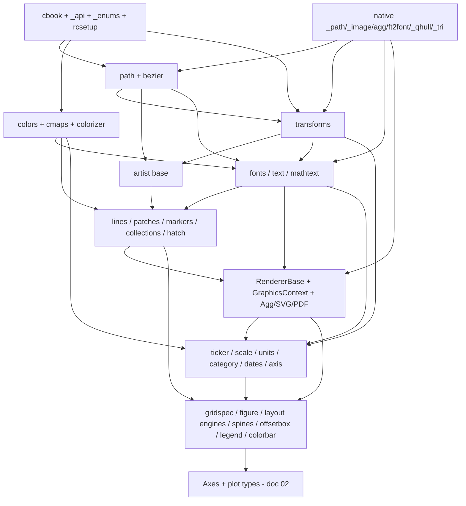

# 03 — Foundational Components ("The Engine Room")

> Deep inspection of matplotlib's shared tooling and foundational primitives — the
> cross-cutting infrastructure that every plot type and every backend is built on.
> This document is the companion to `01-architecture.md` (overall design) and
> `02-plot-types.md` (the chart-level artists). Here we catalogue the *engine room*:
> the primitives, the math, the config, and the native layer.
>
> All file:line references are into `references/matplotlib/` (package
> `lib/matplotlib/`, native code `src/`). Line numbers are from the cloned tree and
> may drift by a line or two against upstream.
>
> The purpose is twofold:
> 1. Understand *what must exist* before any plotting can work (a build-order DAG).
> 2. Map each component to candidate Rust crates / "must build ourselves" verdicts,
>    flagging wasm constraints, for the **rizzma** reimplementation.

---

## Table of Contents

1. [Transforms](#1-transforms-transformspy)
2. [Path & Geometry](#2-path--geometry-pathpy-bezierpy-_path-native)
3. [Color](#3-color-colorspy-cmpy-colorizerpy-_cm_color_data)
4. [Text, Fonts & Math](#4-text-fonts--math)
5. [Artist Primitives Shared Across Plots](#5-artist-primitives-shared-across-plots)
6. [Axis Machinery](#6-axis-machinery-axispy-tickerpy-scalepy-unitspy-categorypy-datespy)
7. [Rendering Backend Substrate](#7-rendering-backend-substrate)
8. [Layout & Figure Scaffolding](#8-layout--figure-scaffolding)
9. [Core Utilities & Infra](#9-core-utilities--infra)
10. [Native / Performance Layer](#10-native--performance-layer-src)
11. [Dependency DAG (Build Order)](#11-dependency-dag-build-order)
12. [Rust + wasm Mapping](#12-rust--wasm-mapping)
13. [Recommended Foundational Build Order](#13-recommended-foundational-build-order)

---

## 0. The Big Picture: how the engine room fits together

Every drawable thing in matplotlib is an `Artist` (`lib/matplotlib/artist.py:110`).
An Artist owns:

- a **Transform** (where it lives in coordinate space),
- one or more **Path** objects (its geometry), possibly via **Patch**/**Line2D**/**Collection** wrappers,
- a **GraphicsContext** worth of style state (color, linewidth, dash, cap/join, clip, alpha, hatch),
- and a `draw(renderer)` method that ultimately calls **RendererBase** primitives.

The data-to-pixel pipeline is:

```
data values
   │  (units framework: units.py / dates.py / category.py convert to floats)
   ▼
data coordinates  ──Scale.get_transform()──►  (log/logit/symlog nonlinearity)
   │
   ▼
Axes transform stack (transData = nonlinear + Affine)  ── transforms.py
   │
   ▼
Figure / display (pixel) coordinates
   │
   ▼
RendererBase.draw_path / draw_markers / draw_text / draw_path_collection ...
   │
   ▼
Agg (raster, native C++)  or  SVG/PDF/PS (vector, Python)  → bytes
```

The five "load-bearing walls" — the things that literally everything imports — are:
**transforms**, **path**, **colors**, **cbook/_api** (utilities), and **artist**. They
have essentially no intra-matplotlib dependencies and must be built first.

---

## 1. Transforms (`transforms.py`)

**File:** `lib/matplotlib/transforms.py` (3052 lines). One of the two or three most
foundational modules — imported by path consumers, every Artist, every Axes, every
backend.

### 1.1 Responsibility

A framework for *arbitrary geometric transformations* arranged as a **lazily-evaluated,
invalidation-propagating tree**. When a child changes, parents are invalidated; the
next access recomputes. This caching is what makes interactive panning/zooming cheap.

Crucial design split (module docstring, `transforms.py:18-28`):
```
full transform == non-affine part + affine part   (affine always applied last)
```
The **affine part is pushed down to the backend** (Agg/SVG can apply a 3×3 matrix
cheaply); only the **non-affine part** (log, polar, custom projections) is evaluated
in Python/numpy before handing vertices to the renderer.

### 1.2 Key classes

| Class | Line | Role |
|---|---|---|
| `TransformNode` | `82` | Base of everything in the tree; holds `_parents` (weakrefs), `_invalid` tri-state, invalidation propagation. |
| `BboxBase` | `207` | Immutable bounding box interface (two corner points; `x0,y0,x1,y1`, `xmin/xmax`, width/height as *computed* properties). Is itself a `TransformNode` because transforms depend on bboxes. |
| `Bbox` | `692` | Mutable bbox; `update_from_data_xy`, `union`, `intersection`, `from_bounds`. |
| `TransformedBbox` | `1132` | A bbox = (another bbox) under (a transform); recomputed on invalidation. |
| `LockableBbox` | `1207` | Bbox with some edges pinned. |
| `Transform` | `1328` | Base of all real transforms. Declares `input_dims`, `output_dims`, `is_separable`, `has_inverse`. `__add__` composes (`A + B` ⇒ apply A then B). |
| `TransformWrapper` | `1745` | Mutable indirection node — lets you swap the underlying transform (used when an Axes changes scale) without rebuilding the tree. |
| `AffineBase` / `Affine2DBase` | `1823` / `1873` | Read-only affine interface; matrix is `3×3`. `transform_affine` calls native `affine_transform`. |
| `Affine2D` | `1941` | **Mutable** affine: `translate`, `scale`, `rotate`, `rotate_deg`, `skew`, `from_values(a,b,c,d,e,f)`, `clear`. The workhorse. |
| `IdentityTransform` | `2163` | Affine identity, special-cased for speed. |
| `BlendedGenericTransform` | `2231` | x and y use *different* transforms (e.g. x in data coords, y in axes coords) — the classic "blended" transform. |
| `BlendedAffine2D` | `2324` | Fast path when both halves are affine. |
| `CompositeGenericTransform` | `2391` | a → b composition, `pass_through=True` so invalidation always propagates. Smart `_invalidate_internal` upgrades an affine-only invalidation to FULL when the right child is non-affine (`2430`). |
| `CompositeAffine2D` | `2505` | a → b when both affine; collapses to a single matrix multiply. |
| `BboxTransformTo` / `BboxTransformFrom` | `2627` / `2665` | Map unit square ↔ a bbox. The core of "axes coordinates". |
| `ScaledTranslation` | `2700` | Offset by (dx,dy) scaled by a transform — used for text offset, annotations. |
| `TransformedPath` | `2778` | Caches a Path transformed through the *affine* part, re-deriving only when the non-affine part changes. The key performance object for redraw. |

### 1.3 Invalidation / caching graph (the clever part)

- `TransformNode._invalid` is tri-state: `_VALID (0)`, `_INVALID_AFFINE_ONLY (1)`,
  `_INVALID_FULL (2)` (`transforms.py:95`).
- `set_children(*children)` (`178`) registers `self` as a *weakref parent* on each
  child, with a finalizer callback that prunes the dict — avoids `WeakValueDictionary`
  overhead while still letting dead nodes be GC'd.
- `invalidate()` (`154`) chooses affine-only vs full based on `is_affine`, then
  `_invalidate_internal` (`163`) walks up `_parents`. The short-circuit at `170`
  (`if level <= self._invalid and not self.pass_through: return`) is what stops
  redundant re-propagation — a node already "more invalid" doesn't re-notify.
- Affine transforms cache `_inverted` (`Affine2DBase.inverted`, `1929`) via numpy
  `inv()`; non-affine inversion is per-subclass.

**Porting note:** This is the single most important algorithmic idea to replicate in
Rust. The Python version leans on weakrefs + GC; a Rust version will likely use an
arena/`generational-arena` or `slotmap` with explicit dirty flags and version counters
rather than weakrefs, or a simpler "rebuild on every draw" model if the interactive
case is deprioritized for wasm static rendering.

### 1.4 Nonlinear transforms

Log/logit/symlog transforms are **not** in `transforms.py` — they live with their
`Scale` in `scale.py` (e.g. `LogTransform`, `LogitTransform`, `SymmetricalLogTransform`).
`transforms.py` provides only the affine machinery + the composition/blending/invalidation
substrate. The nonlinear transforms subclass `Transform` (`1328`) and override
`transform_non_affine` + `inverted`. See §6.3.

### 1.5 The transform stack (data / axes / figure / display)

Built by the Axes (not in this file), but the *vocabulary* is here:

- `transData` = `(axes' x-scale transform blended with y-scale transform)` + `transLimits` + `transAxes`.
- `transAxes` = `BboxTransformTo(axes.bbox)` — unit square → axes position.
- `transFigure` = `BboxTransformTo(figure.bbox)`.
- display = pixels (identity at the top).

The blended/composite/bbox transforms above are exactly the Lego bricks the Axes snaps
together to build `transData`.

### 1.6 Dependency note

**Depended on by:** path consumers, `artist.py`, every Artist subclass, `axis.py`,
`scale.py`, `collections.py`, every backend renderer, `figure.py`, `offsetbox.py`,
`legend.py`. **Depends on:** `path.py` (for `TransformedPath`), native `_path`
(`affine_transform`, `count_bboxes_overlapping_bbox`, imported at `transforms.py:48`),
numpy. So: **path + native `_path` come first, then transforms.**

---

## 2. Path & Geometry (`path.py`, `bezier.py`, `_path` native)

**Files:** `lib/matplotlib/path.py` (1146), `lib/matplotlib/bezier.py` (690),
native `src/_path.h`, `src/_path_wrapper.cpp`, `src/path_converters.h`.

### 2.1 The `Path` object (`path.py:24`)

A polyline/curve made of **two parallel numpy arrays**:

- `vertices`: `(N, 2)` float array.
- `codes`: `(N,)` `uint8` array (or `None` ⇒ implicit MOVETO + LINETOs).

Codes (`path.py:82-87`): `STOP=0`, `MOVETO=1`, `LINETO=2`, `CURVE3=3` (quadratic
Bézier, 1 ctrl + 1 end), `CURVE4=4` (cubic Bézier, 2 ctrl + 1 end), `CLOSEPOLY=79`.
`NUM_VERTICES_FOR_CODE` (`91`) maps code → vertex count. This SVG-path-like model is
the *universal geometry currency* — markers, patches, text glyphs, collections all
reduce to `Path`.

Construction (`__init__`, `path.py:98`) is deliberately treated as immutable
(`readonly` flag) so the constructor can precompute `_simplify`, `_should_simplify`,
`_has_nonfinite`, codes-implied flags (`_update_values`, `201`).

### 2.2 Key methods (note how many delegate to native `_path`)

| Method | Line | Native call | Purpose |
|---|---|---|---|
| `iter_segments` | `366` | (pure Python, but calls `cleaned`) | Canonical iterator yielding `(verts, code)` pairs; handles `codes=None`, NaN removal, clipping, simplification. |
| `cleaned` | `489` | `_path.cleanup_path` (`500`) | Apply transform, remove NaNs, clip, simplify, snap — returns a new Path. |
| `transformed` | `508` | — | Return Path with vertices run through a transform. |
| `contains_point` | `521` | `_path.point_in_path` (`569`) | Point-in-polygon test (even-odd / winding). |
| `contains_points` | `571` | `_path.points_in_path` (`612`) | Vectorized for many points. |
| `contains_path` | `615` | `_path.path_in_path` (`624`) | Path containment. |
| `intersects_path` | `667` | `_path.path_intersects_path` (`674`) | Curve/segment intersection. |
| `intersects_bbox` | `676` | `_path.path_intersects_rectangle` (`685`) | |
| `interpolated` | `688` | — | Subdivide segments (e.g. for polar). |
| `to_polygons` | `728` | `_path.convert_path_to_polygons` (`772`) | Flatten curves → polygon vertex lists. |
| `clip_to_bbox` | `1093` | `_path.clip_path_to_rect` (`1103`) | Sutherland–Hodgman style clip. |
| `get_extents` (class helper) | `1143` | `_path.get_path_collection_extents` | Bounding box of (collections of) paths. |

**Unit shape factories** (cached, readonly): `unit_rectangle` (`778`),
`unit_regular_polygon` (`790`), `unit_regular_star` (`814`),
`unit_regular_asterisk` (`838`), `unit_circle` (`848`, a 4-cubic-Bézier circle
approximation), `unit_circle_righthalf` (`930`), wedge/arc helpers. These are the
primitive shapes that `markers.py` and `patches.py` build on.

### 2.3 `bezier.py` (690 lines)

Pure-Python/numpy Bézier math used by patches, arrows, `FancyArrowPatch`, connection
styles, and curve splitting:

- `BezierSegment` (`273`): evaluate a Bézier of arbitrary order at `t`, axis extrema,
  arc-length helpers.
- `split_de_casteljau` (`179`), `_de_casteljau1` (`174`): subdivision.
- `find_bezier_t_intersecting_with_closedpath` (`197`),
  `split_bezier_intersecting_with_closedpath` (`405`),
  `split_path_inout` (`439`): clip a curve where it crosses a boundary (arrowheads,
  patch boundaries).
- `get_parallels` (`558`), `make_wedged_bezier2` (`642`), `find_control_points` (`632`):
  offset curves for variable-width arrows.
- `get_intersection`, `get_normal_points`, `inside_circle`, `get_cos_sin`,
  `check_if_parallel`: geometry helpers.
- Root-finding for quadratics in `[0,1]` (`_quadratic_roots_in_01`, `_real_roots_in_01`).

### 2.4 Why `_path` is native (C++)

`src/_path_wrapper.cpp` + `src/_path.h` + `src/path_converters.h`. These run on
**large vertex arrays** in tight loops where the Python interpreter overhead would
dominate. The native side implements:

- **Affine transform of vertex arrays** (`affine_transform`) — applied per-frame to
  every path.
- **`cleanup_path`** — the per-draw "path conditioning" pipeline (NaN handling,
  clipping, simplification, snapping) wrapped as C++ *path converter* iterators
  (`path_converters.h` defines `PathNanRemover`, `PathClipper`, `PathSimplifier`,
  `PathSnapper`, `Sketch` as composable stream converters).
- **Point/path containment, intersection, extents** — geometric predicates.
- **`get_path_collection_extents`** — bbox over thousands of offset paths in one call.

The *path simplification* algorithm (in `path_converters.h`) drops vertices that are
collinear-enough within `simplify_threshold` (`path.py:242`, default from
`rcParams["path.simplify_threshold"]`) — essential when plotting million-point lines.

### 2.5 Dependency note

**Depends on:** native `_path`, `bezier.py`, `cbook` (`_to_unmasked_float_array`,
`simple_linear_interpolation`), numpy. **Depended on by:** transforms (`TransformedPath`),
**everything that draws** (markers, patches, collections, text glyph paths, hatch,
axes spines, the renderer primitive API). Path is in the absolute foundation tier with
transforms.

---

## 3. Color (`colors.py`, `cm.py`, `colorizer.py`, `_cm*`, `_color_data`)

**Files:** `lib/matplotlib/colors.py` (4281), `cm.py` (241),
`colorizer.py`, `_cm.py` / `_cm_listed.py` / `_cm_bivar.py` / `_cm_multivar.py`,
`_color_data.py`.

### 3.1 Color conversion & named colors

- `to_rgba(c, alpha)` (`colors.py:314`) — the universal color parser. Accepts:
  named color, hex `#rgb`/`#rgba`/`#rrggbb`/`#rrggbbaa`, RGB(A) tuple, grayscale
  string `"0.5"`, `"C0"` cycle reference (`_is_nth_color`, `221`), `"none"`. Cached.
  `_to_rgba_no_colorcycle` (`361`) is the inner parser.
- `to_rgba_array` (`446`), `to_rgb` (`554`), `to_hex` (`563`).
- Named color tables in `_color_data.py`: `BASE_COLORS` (the 8 single-letter `b g r c
  m y k w`), `TABLEAU_COLORS` (the `tab:` palette / default cycle), `CSS4_COLORS` (the
  148 X11/CSS names), `XKCD_COLORS` (the 949 `xkcd:` survey names). Merged via
  `_ColorMapping` / `get_named_colors_mapping` (`colors.py:62`, `94`).
- `ColorConverter` (`594`) is the legacy class wrapper; `is_color_like` (`226`),
  `same_color` (`287`) are validators.
- HSV conversion: `rgb_to_hsv` (`3646`), `hsv_to_rgb` (`3710`). `LightSource` (`3802`)
  for hillshading.

### 3.2 Colormaps

- `Colormap` (`713`) — abstract base. `__call__(X, alpha, bytes)` (`764`) maps
  normalized floats in `[0,1]` (or ints in `[0,N)`) to RGBA, with dedicated slots for
  *under* (`_i_under = N`), *over* (`N+1`), *bad/NaN* (`N+2`). `N` = quantization
  levels (default 256). Lazily initialized lookup table (`_isinit`, `_init`).
- `LinearSegmentedColormap` (`1087`) — built from piecewise-linear `(x, y0, y1)`
  segment data per channel, expanded into the LUT by `_create_lookup_table` (`615`).
  This function is the core algorithm: linear interpolation between segment anchors
  with optional `gamma` distortion of the input sampling (`615-712`). `from_list`
  classmethod builds one from a color list.
- `ListedColormap` (`1299`) — an explicit list of colors (e.g. the `viridis`/`tab10`
  data lives as arrays in `_cm_listed.py`); the classic `_cm.py` holds the segment-data
  colormaps (jet, hsv, the Brewer maps, etc.).
- `MultivarColormap` (`1432`), `BivarColormap` (`1687`) and subclasses — 2-input
  colormaps (newer feature; lower porting priority).

### 3.3 Normalization (data → `[0,1]`)

- `Norm` (ABC, `2314`) / `Normalize` (`2405`) — linear `[vmin, vmax] → [0,1]`, with
  `clip`. `autoscale`, `autoscale_None`, `scaled`, `inverse`. `vmin`/`vmax` are
  change-tracked properties that fire `_changed()` callbacks (`2461-2480`).
- The **elegant trick**: `make_norm_from_scale(scale_cls, base_norm_cls)` (`2841`) is a
  decorator that *generates* a Norm from a `ScaleBase`, forwarding the normalization to
  the scale's transform. This is how `LogNorm`, `SymLogNorm` (`3054`), `AsinhNorm`
  (`3091`), `FuncNorm` (`3010`) are produced — **norms and axis scales literally share
  the same nonlinear transform.** `_make_norm_from_scale` (`2891`) is `@functools.cache`d.
- Hand-written norms: `PowerNorm` (`3120`, gamma), `BoundaryNorm` (`3208`, maps onto
  discrete color bins — used by contour/pcolormesh with discrete levels),
  `TwoSlopeNorm` (`2628`), `CenteredNorm` (`2723`), `NoNorm` (`3336`),
  `MultiNorm` (`3352`).

### 3.4 The Colorizer / ScalarMappable pipeline (modern refactor)

Recent matplotlib split the old `ScalarMappable` mixin into `colorizer.py`:

- `Colorizer` (`colorizer.py:38`) — owns a `cmap` + a `norm` and runs the
  **data → normalize → map-to-color** pipeline via `to_rgba` (`108`). Holds a
  `CallbackRegistry` for `"changed"` and a back-reference to its colorbar.
- `_ScalarMappable` / `_ColorizerInterface` (`colorizer.py:316`) — the mixin that
  image/collection/etc. artists inherit (`set_clim`, `set_cmap`, `set_norm`,
  `autoscale`, `to_rgba`). Re-exported as `ScalarMappable` from `cm.py:22`.
- `ColormapRegistry` (`cm.py:66`) — the `matplotlib.colormaps[...]` registry;
  `_gen_cmap_registry` (`32`) assembles all builtin maps at import.

### 3.5 Colorbar plumbing

`colorbar.py`: `Colorbar` (`210`) draws a small Axes showing the cmap+norm; `make_axes`
(`1393`) / `make_axes_gridspec` (`1497`) steal space from a parent Axes for it. It is a
*consumer* of (Colormap, Norm, Axes, transforms) — sits above this foundation tier.

### 3.6 Dependency note

**Depends on:** numpy, `scale.py` (for `make_norm_from_scale`), `cbook`, `_api`.
**Depended on by:** every ScalarMappable artist (images, `pcolormesh`/`QuadMesh`,
scatter `PathCollection`, contour), the prop-cycle, patches/lines (face/edge colors),
colorbar. `to_rgba` specifically is called by *everything*. Color is in the
foundation tier (note the small forward-dependency on `scale.py` for the norm-from-scale
trick — that one decorator can be deferred/built last in the module).

---

## 4. Text, Fonts & Math

**Files:** `text.py` (2254), `font_manager.py` (1853), `_afm.py`, `mathtext.py` (140),
`_mathtext.py` (3054), `textpath.py`, `dviread.py` (1844), `_type1font.py`, plus native
`src/ft2font.{cpp,h}`, `src/ft2font_wrapper.cpp`.

### 4.1 `font_manager.py` — discovery & matching

- `FontProperties` — a *query*: family list, style, variant, weight, stretch, size.
  Parsed from a font string or `fontconfig` pattern (`_fontconfig_pattern.py`).
- `FontManager` — scans the OS font directories at first run, builds a list of
  `FontEntry` records (name, file, style, weight, stretch, size), and **caches it to a
  JSON file** (so the expensive directory walk happens once). On a new matplotlib
  version the cache is rebuilt.
- **`findfont(prop)`** (`font_manager.py:1462`) → `_findfont_cached` (`1629`): the
  matching algorithm. It scores every candidate font against the query as a **weighted
  sum** (`1652-1657`):
  ```
  score = score_family   * 10     # family match dominates
        + score_style                # normal/italic/oblique
        + score_variant              # normal/small-caps
        + score_weight               # 100..900 numeric distance
        + score_stretch              # condensed..expanded
        + score_size                 # 0 if scalable, else size distance
  ```
  Lowest score wins; a perfect family+style+weight match scores 0.
  `score_family` (`1344`), `score_weight` (`1420`, normalizes named weights to the
  100–900 axis then distance), `score_size` (`1438`, free for scalable fonts).
  Lowest score wins, with a **short-circuit on score 0** (`1662`). The sub-scores are
  each in `[0,1]`: `score_family` 0 if exact head-of-list match, scaling with list
  position, generic aliases (serif/sans-serif/…) expanded via rcParams;
  `score_style` italic↔oblique = 0.1; `score_weight` = `0.95·|w1−w2|/1000 + 0.05` on the
  numeric CSS weight axis; `score_stretch` = `|s1−s2|/1000`; `score_size` = 0 for
  scalable fonts (all TTF). If `best_score ≥ 10` (family didn't match at all) it falls
  back to `defaultFamily` (**DejaVu Sans**, bundled). `_findfont_cached` is `@lru_cache(1024)`.
  Weight derivation in `ttfFontProperty` (`font_manager.py:424`) is a direct port of
  fontconfig's `FcFreeTypeQueryFaceInternal`: OS/2 `usWeightClass` → PS info → style-name
  regex → default 500.

- **`_afm.py`** — parses Adobe Font Metrics files (the 14 standard PostScript fonts'
  metrics) for the PDF/PS backends so glyphs can be measured without rasterizing.

**Porting note (wasm):** there is *no filesystem font discovery in the browser.* rizzma
must **bundle** fonts (DejaVu Sans / a math font) as embedded bytes, or load them via
`fetch`. The whole `FontManager` directory-walk + JSON cache machinery collapses to "a
static list of embedded fonts" in wasm. Native builds can still do FS discovery.

### 4.2 `ft2font` (native) — why FreeType is C

`src/ft2font.cpp` (~core), `ft2font.h`, `ft2font_wrapper.cpp` (Python binding). This is
a thin binding over the **FreeType** C library. Native because FreeType *is* C and does
the hard work:

- Load a font file, set size/DPI.
- **Glyph rasterization** to anti-aliased bitmaps (the Agg backend composites these).
- **Glyph metrics**: advance, bearing, bbox — needed for layout.
- **Kerning** pairs.
- Glyph **outlines** as paths (consumed by `textpath.py` to turn text into `Path`s for
  vector backends and for the `TextPath`/`PathEffects` features).

`get_text_width_height_descent` on the renderer ultimately calls into ft2font for raster
backends. Vector backends (PDF/PS) can use AFM metrics instead.

### 4.3 `text.py` — layout, rotation, anchoring

- `Text` (Artist subclass) — string + position + font props + rotation + alignment.
- Layout: splits on `\n`, measures each line (via renderer →
  `get_text_width_height_descent`), stacks lines per `linespacing`, applies
  `horizontalalignment` / `verticalalignment` (left/center/right, top/center/bottom/
  baseline), and a `rotation` (degrees or `'vertical'`/`'horizontal'`), optionally with
  a rotated bounding box (`rotation_mode='anchor'`).
- `get_window_extent` returns the screen bbox (used by layout engines, legend, clipping).
- `Annotation` (also in `text.py`) adds an arrow + a second coordinate system for the
  text vs. the pointed-at location.

### 4.4 mathtext — a tiny TeX engine

`mathtext.py` (the public `MathTextParser`, `140` lines) + `_mathtext.py` (3054 lines,
the engine) + `_mathtext_data.py` (glyph tables, symbol → font/codepoint maps).

This is a **box-and-glue layout model copied from TeX**:

- A `Parser` (pyparsing-based grammar) turns a `$...$` string into a tree of nodes
  (`Hlist`, `Vlist` boxes; `Char`, `Kern`, `Glue` items; super/subscripts, fractions,
  radicals, accents, delimiters).
- `Ship` walks the box tree and emits absolute-positioned glyphs + rules (lines).
- Fonts: a `Fonts` abstraction (`BakomaFonts`, `DejaVuFonts`, `StixFonts`,
  `UnicodeFonts`) maps math symbols to actual glyphs across several font families,
  using ft2font for metrics.
- Output is either rasterized (Agg) or converted to `Path`s (vector backends) — the
  same dual path as regular text.

**Verified specifics** (`_mathtext.py`): the `Parser` (`_mathtext.py:1939`) is a
**pyparsing** grammar with packrat caching; nodes are `Node`→`Box`(width/height/depth)/
`Char`/`Kern`/`Glue`(stretch/shrink with a `_GlueSpec`)/`Rule`, grouped into
`Hlist`/`Vlist`. The layout core is TeX's **hpack** (`Hlist.hpack`, `1357`: sum child
widths, max height/depth, distribute glue to hit target width) and **vpack**
(`Vlist.vpack`, `1435`). `ship` (`1708`) walks the box tree via mutually-recursive
`hlist_out`/`vlist_out` maintaining `cur_h`/`cur_v` cursors, emitting positioned glyphs +
rects into an `Output`. Sub/superscript shrinking uses `SHRINK_FACTOR=0.7`,
`NUM_SIZE_LEVELS=6`. Per-font `FontConstantsBase` supplies the metrics TeX can't read
from the font (drop ratios, axis height, quad). Glyph metrics come from ft2font via
`TruetypeFonts._get_info` (`388`) using the same 64/65536 fixed-point divisors.

This is **large and intricate**; for rizzma it is a "build ourselves later, scope
carefully" item. **The box-and-glue layout is pure algorithm and ports directly** (no
native dep); the biggest effort is replacing the pyparsing grammar with a Rust parser
(`nom`/`chumsky`/hand-rolled), plus embedding cm/DejaVu/STIX fonts and the
`_mathtext_data` tables. A minimal subset (super/subscripts, common symbols, fractions)
covers most real plots.

### 4.5 usetex path: `dviread.py`, `_type1font.py`

When `text.usetex=True`, matplotlib shells out to a real LaTeX + dvipng/dvips, then:

- `dviread.py` parses the **DVI** binary output into positioned glyphs.
- `_type1font.py` parses **Type 1** PostScript fonts (decrypt eexec, parse charstrings)
  to embed/subset them.

**Porting note:** usetex requires an external LaTeX install — *impossible in wasm* and a
heavy dependency natively. rizzma should treat usetex as out-of-scope and lean on the
internal mathtext engine for math.

### 4.6 Dependency note

**Depends on:** native ft2font (+FreeType), `path.py`, `transforms.py`, `cbook`, numpy.
**Depended on by:** every axis tick label, title, legend text, annotations, `text()`,
colorbar labels, `offsetbox.TextArea`. Text/fonts is a *mid-tier* foundation: it needs
path+transforms+the font binding first, but almost every finished plot needs it.

---

## 5. Artist Primitives Shared Across Plots

**Files:** `artist.py` (the base), `lines.py` (1732), `patches.py` (4906),
`markers.py` (907), `collections.py` (2704), `container.py`.

### 5.1 `Artist` — the universal ancestor (`artist.py:110`)

Everything drawable inherits from `Artist`. Shared state/behavior:

- **Transform**: `set_transform` (`464`) / `get_transform`; the artist's geometry lives
  in some coordinate system and is composed onto the renderer.
- **Visibility / zorder / alpha / clip path / clip box / url / gid / sketch / animated**.
- **`draw(renderer)`** — the polymorphic entry point each subclass overrides; wrapped by
  `allow_rasterization` (`artist.py:31`) to support per-artist rasterization in vector
  output.
- **`get_window_extent(renderer)`** (`337`) — screen bbox, used by layout/legend/clip.
- **The stale/invalidation mechanism** (`stale` property `317`, setter `325`): setting
  any visual property sets `self.stale = True`, which fires `stale_callback` →
  propagates `stale` up to the Axes and Figure (`_stale_axes_callback`, `260-266`,
  `314`). This is the *redraw-needed* signal (analogous to, but separate from, the
  transform invalidation graph).
- Pick/event support, `set`/`update` bulk property setting, `findobj`.

`artist.py` is foundation-tier: it depends only on transforms, path, cbook, and is the
base class import for §5 and most of §6/§8.

### 5.2 `Line2D` (`lines.py`)

A polyline + optional markers. Holds `xdata`/`ydata`, a linestyle/dash pattern, a
`MarkerStyle`, colors, linewidth, cap/join. `draw` builds a `Path` from the data,
caches the transformed segments, applies dash conversion, and calls
`renderer.draw_path` (line) + `renderer.draw_markers` (markers). Dash patterns are
resolved from named styles (`'-'`, `'--'`, `'-.'`, `':'`) to on/off sequences. Segment
caching avoids re-transforming on every draw.

### 5.3 `MarkerStyle` (`markers.py`)

Each marker (`'o'`, `'s'`, `'^'`, `'*'`, `'+'`, `'x'`, `'.'`, `','`, `'D'`, `'|'`, `'_'`,
`'1'..'4'`, `'P'`, `'X'`, numeric polygon specs, `'$...$'` text markers, custom `Path`)
resolves to a **unit `Path` + a transform** (and a fillstyle: full/left/right/top/
bottom/none). The marker paths come from `Path.unit_*` factories (§2.2). `markers.py` is
basically a big dispatch table from marker code → path + fillstyle. Foundation for
scatter, line markers, errorbars.

### 5.4 The `Patch` hierarchy (`patches.py`)

`Patch` (base) = a filled/edged shape: holds face color, edge color, linewidth, linestyle,
hatch, and a `get_path()` returning the shape in its *own* coordinate system plus
`get_patch_transform()` placing it. `draw` calls `renderer.draw_path`. The pattern
**"each patch computes a unit-ish Path + a transform"** is pervasive:

| Patch | Geometry |
|---|---|
| `Rectangle` | unit rectangle scaled/translated |
| `Circle` / `Ellipse` | unit circle (4 cubic Béziers) scaled |
| `Polygon` | explicit vertices |
| `Wedge` | arc path between two angles |
| `Arc` | elliptical arc (stroke only) |
| `FancyArrow` / `FancyArrowPatch` | bezier.py-built arrow body + head |
| `FancyBboxPatch` | rounded/decorated box (uses `BoxStyle` registry) |
| `PathPatch` | arbitrary `Path` |
| `RegularPolygon`, `CirclePolygon`, `Annulus`, `Shadow` | … |

The load-bearing pattern (`patches.py:313-333`): `get_transform() =
get_patch_transform() + Artist.get_transform()`, and `Patch.draw` (`736`) splits the
transform — `tpath = transform.transform_path_non_affine(path)` bakes the curvy part into
vertices, `affine = transform.get_affine()` is passed separately to `renderer.draw_path`
(the renderer fast-paths the affine). Two families: **unit-shape + affine**
(Rectangle → `unit_rectangle` + `BboxTransformTo`; Ellipse/Circle/Arc → `unit_circle` +
`Affine2D.scale.rotate.translate`, recomputing only the affine) vs **geometry baked into
a data-space Path + identity patch transform** (Wedge/Polygon/PathPatch/FancyArrow/
FancyBboxPatch). `Arc.draw` (`2173`) is special: for very large ellipses it inverse-maps
the viewport into unit-circle space, intersects each viewport edge with the circle, and
strokes **only the visible sub-arcs** (avoids the 8-Bézier approximation error + cost).

`patches.py` also defines `BoxStyle`, `ConnectionStyle`, `ArrowStyle` registries (used by
annotations, `FancyBboxPatch`, `FancyArrowPatch`) — callable `_Style` registries that
return mutated `Path`s. It is large (4906 lines) but mostly mechanical path-generation +
style plumbing → port the registries as enums with associated path-builders.

### 5.5 The `Collection` family — *why collections exist* (performance)

`collections.py` is **performance-critical**. A naive design draws N markers as N
artists ⇒ N renderer round-trips ⇒ slow for scatter plots with 10⁵ points.

A `Collection` (`collections.py:36`, subclass of `ColorizingArtist`) instead holds
**arrays**: a small set of base paths, per-element offsets, per-element face/edge colors,
linewidths, etc., and in **one** `draw` (`361`) issues a **single**
`renderer.draw_path_collection(gc, master_transform, paths, all_transforms, offsets,
offset_transform, facecolors, edgecolors, linewidths, ...)` call (`435/463/488`). The
native renderer then loops in C++ over the offset/color arrays. This is the
vectorized-many-primitive primitive — it is *the* reason large scatter/quiver/mesh plots
are usable.

| Collection | Line | Used by |
|---|---|---|
| `Collection` (base) | `36` | — |
| `_CollectionWithSizes` | `1080` | base for sized scatter markers |
| `PathCollection` | `1127` | `scatter()` |
| `PolyCollection` | `1300` | `fill_between`, `stackplot`, `hexbin` |
| `LineCollection` | `1709` | `eventplot`, contour lines, `vlines/hlines` batches |
| `EllipseCollection` | `2098` | many ellipses |
| `QuadMesh` (further down) | — | `pcolormesh` (a grid of quads, ScalarMappable-colored) |
| `RegularPolyCollection`, `StarPolygonCollection`, `TriMesh` | — | misc |

Collections are `ScalarMappable`s (inherit colorizer), so they tie color §3 to geometry
§2 directly: data values → norm → cmap → per-element RGBA arrays
(`update_scalarmappable`, `collections.py:366/1012`). Properties are **cycled**:
`prop[i % len(prop)]` (`54-56`). The data structures fed to the renderer are `_paths`
(list of Path), `_transforms` (an `(N,3,3)` affine stack), `_offsets` (`(N,2)` screen
translations), and color/lw/ls arrays. **Single-path fast path** (`394-424`): when there
is one path/color/lw with no hatch, `draw` instead calls `renderer.draw_markers(gc,
paths[0], transform, Path(offsets), offset_trf, facecolor)` — blit one stamp at many
offsets (much faster for Agg, smaller for PDF/SVG). `QuadMesh.draw` bypasses the generic
loop entirely and calls `renderer.draw_quad_mesh(...)` (or `draw_gouraud_triangles` for
gouraud shading). `get_datalim` and `contains` use the native `_path` batch calls
(`get_path_collection_extents`, `point_in_path_collection`).

### 5.6 `Container` (`container.py`)

Lightweight tuple-like groupings returned by high-level plotting functions so users can
restyle a logical group: `BarContainer` (bars + errorbars), `ErrorbarContainer`
(line + caps + bars), `StemContainer`. Not drawable themselves — just bookkeeping over
the real artists. Trivial to port.

### 5.7 Dependency note

**Depends on:** `artist.py`, `path.py`, `transforms.py`, `colors`/`colorizer`, `markers`
(for lines/scatter), native `_path` (via the renderer). **Depended on by:** essentially
all of `02-plot-types.md` (every chart is assembled from lines, patches, collections,
text). This is the tier *directly below* the chart-level API.

---

## 6. Axis Machinery (`axis.py`, `ticker.py`, `scale.py`, `units.py`, `category.py`, `dates.py`)

**Files:** `axis.py` (3066), `ticker.py` (3128), `scale.py` (1001), `units.py` (195),
`category.py`, `dates.py` (1844).

### 6.1 `axis.py` — Axis / Tick

- `Axis` (base), `XAxis`, `YAxis` — own the scale, the major & minor `Locator`s and
  `Formatter`s, the label, the tick objects, gridline style, the view interval and data
  interval. `Axis.draw` asks the locator for tick *positions*, the formatter for tick
  *labels*, builds/updates `Tick` artists, and draws ticks + gridlines + labels + axis
  label.
- `Tick` / `XTick` / `YTick` — a tick is a small composite artist: a `Line2D` for the
  tick mark, an optional gridline `Line2D`, and a `Text` for the label, on each side.
- The Axis is the orchestrator that wires **Scale ⇄ Locator ⇄ Formatter ⇄ Transform**.

### 6.2 `ticker.py` — Locators & Formatters (strategy pattern)

**Locators** decide *where* ticks go (`tick_values(vmin, vmax)`):

| Locator | Algorithm |
|---|---|
| `MaxNLocator` (`2111`) | The default "nice numbers" engine. From `_raw_ticks` (`2245`): pick a step from `steps = [1, 1.5, 2, 2.5, 3, 4, 5, 6, 8, 10]` (`2236`) scaled by a power of 10, such that ≤ N ticks span the range, preferring "nice" multiples; `_Edge_integer` (`2063`) handles float-precision-safe `floor/ceil` to step multiples. `scale_range` (`2052`) picks the order of magnitude + offset. |
| `AutoLocator` | a `MaxNLocator` preset (the default for linear axes). |
| `MultipleLocator` | ticks at integer multiples of a base. |
| `FixedLocator` | explicit list. |
| `LinearLocator` | exactly N evenly spaced. |
| `IndexLocator`, `NullLocator` | every-Nth / none. |
| `LogLocator` | decades (powers of base) + optional `subs` for minor ticks. |
| `SymmetricalLogLocator`, `LogitLocator`, `AsinhLocator` | scale-specific. |
| `AutoMinorLocator` | minor ticks subdividing major intervals. |

**Formatters** decide tick *text* (`__call__(value, pos)`):

| Formatter | Behavior |
|---|---|
| `ScalarFormatter` | the default: chooses precision, can factor out a common offset/scientific exponent shown at the axis end. |
| `FormatStrFormatter`, `StrMethodFormatter` | printf-/`str.format`-style. |
| `FuncFormatter` | user callback. |
| `LogFormatter`, `LogFormatterSciNotation`, `LogFormatterMathtext` | `10^n` labels. |
| `PercentFormatter`, `EngFormatter` | `%`, engineering (k/M/G…) suffixes. |

The Locator/Formatter pair is a clean **strategy pattern** — the Axis holds references
and calls them; swapping behavior = swapping the object. Highly portable; the algorithms
(esp. `MaxNLocator`) are the valuable bit to copy faithfully.

### 6.3 `scale.py` — ties transform + locator + formatter together

- `ScaleBase` (`scale.py:47`): the contract is `get_transform()` (`94`),
  `set_default_locators_and_formatters(axis)`, `limit_range_for_scale(vmin,vmax,minpos)`.
- `LinearScale` (`188`) → `IdentityTransform`, `AutoLocator` + `ScalarFormatter`.
- `LogScale` (`381`) → `LogTransform(base, nonpositive)` (`410`); sets `LogLocator` +
  `LogFormatterSciNotation` for major and minor (`415-422`); clamps the domain to
  positive values (`limit_range_for_scale`, `428`). **Here is where the nonlinear
  transform actually lives** (`LogTransform`/`InvertedLogTransform` are defined in this
  module, not `transforms.py`).
- `SymmetricalLogScale`, `LogitScale`, `AsinhScale`, `FuncScale` (`269`, arbitrary
  forward/inverse callables), `FuncScaleLog` (`448`).
- A scale registry (`_scale_mapping`) + `register_scale` / `scale_factory` resolve string
  names like `'log'` to classes.

The key insight for rizzma: **a Scale is a bundle of {nonlinear transform, default tick
locator, default tick formatter, domain limiter}.** Get this abstraction right and
log/symlog/logit fall out cleanly, and the `make_norm_from_scale` decorator (§3.3)
reuses the very same transforms for colorbars.

### 6.4 `units.py` — the conversion framework

- `ConversionInterface` (the contract: `convert(value, unit, axis)`,
  `axisinfo(unit, axis)`, `default_units(value, axis)`).
- `AxisInfo` — bundles the default locator/formatter/label/limits a unit implies.
- `Registry` (a dict mapping a Python *type* → a converter). When you plot
  `datetime`/`str`/`Decimal`/a `pint` quantity, the registry's converter turns it into
  floats *and* tells the axis what locator/formatter to use.

This is the extensibility seam for non-numeric axes. Small file, conceptually important.

### 6.5 `category.py` — string/categorical axes

`StrCategoryConverter` (a `ConversionInterface`) maps unique strings → integers
0,1,2,… and installs a `FixedLocator` + a formatter that maps back to the strings.
This is how `bar(['a','b','c'], …)` works.

### 6.6 `dates.py` — date/time axes

- Epoch model: `date2num` / `num2date` convert `datetime`/`np.datetime64` to floats
  (days since an epoch, default `1970-01-01`, configurable via `set_epoch`).
- `DateLocator` family: `AutoDateLocator` picks an appropriate tick spacing
  (year/month/day/hour/minute/second) by **scale selection** — it inspects the visible
  span and chooses the finest unit whose tick count stays within bounds, delegating to
  `rrule`-based `RRuleLocator`s (`YearLocator`, `MonthLocator`, `DayLocator`,
  `HourLocator`, …). Uses `dateutil.rrule`.
- `DateFormatter` (strftime) / `AutoDateFormatter` / `ConciseDateFormatter` (compact,
  context-aware labels).

`dates.py` is a `units.py` converter writ large; date handling is a self-contained,
deferrable subsystem (port after the numeric axis works).

### 6.7 Dependency note

**Depends on:** `transforms`, `ticker`↔`scale` (mutual), `units`, `text` (tick labels),
`lines`/`patches` (tick marks/gridlines), `cbook`/`_api`. **Depended on by:** Axes
(chart layer). The axis machinery sits between the artist tier and the chart tier.

---

## 7. Rendering Backend Substrate

**Files:** `backend_bases.py` (3737), `_enums.py`, native `src/_backend_agg.{cpp,h}` +
`_backend_agg_wrapper.cpp`, `backends/backend_agg.py`, `backends/backend_svg.py`,
`backends/backend_pdf.py`.

### 7.1 `RendererBase` — THE primitive interface (`backend_bases.py`)

This abstract class defines the **contract every backend implements** and that **every
`Artist.draw` calls into.** The required/overridable primitives:

| Method | Line | Contract |
|---|---|---|
| `draw_path(gc, path, transform, rgbFace=None)` | `175` | Stroke (per gc) and optionally fill a single `Path` under an affine transform. **The fundamental primitive** — everything else can fall back to this. |
| `draw_markers(gc, marker_path, marker_trans, path, trans, rgbFace)` | `179` | Draw the marker path at every vertex of `path`. Default impl loops calling `draw_path` (`202-208`); backends override to cache the stamp. |
| `draw_path_collection(gc, master_transform, paths, all_transforms, offsets, offset_trans, facecolors, edgecolors, linewidths, linestyles, antialiaseds, urls, offset_position)` | (further down) | **Vectorized** many-path draw — the §5.5 batch primitive. Default impl synthesizes per-element `draw_path` calls; Agg does it in C++. |
| `draw_quad_mesh(...)` | — | Specialized `pcolormesh` grid (default → `draw_path_collection`). |
| `draw_gouraud_triangles(gc, points, colors, transform)` | — | Gouraud-shaded triangles (tripcolor / shading='gouraud'). |
| `draw_image(gc, x, y, im, transform=None)` | — | Blit an RGBA array. |
| `draw_text(gc, x, y, s, prop, angle, ismath, mtext)` | — | Render a text string. Default rasterizes via `_text2path`/ft2font or mathtext. |
| `get_text_width_height_descent(s, prop, ismath)` | — | Measure text (drives all text layout & autolayout). |

Plus grouping hooks `open_group`/`close_group` (`161`/`168`, used by SVG for `<g>`),
`new_gc`, `points_to_pixels` (DPI), `start_rasterizing`/`stop_rasterizing` (mixed
vector+raster), `flipy`, `get_canvas_width_height`. The base ctor builds a
`TextToPath` helper (`backend_bases.py:157`).

### 7.2 `GraphicsContextBase` — the style state bundle (`backend_bases.py:701`)

A mutable struct of *current drawing state* passed as `gc` to every primitive:
`_alpha`/`_forced_alpha`, `_antialiased`, `_capstyle` (`CapStyle('butt')`),
`_joinstyle` (`JoinStyle('round')`), `_cliprect`, `_clippath`, `_dashes` (offset, seq),
`_linestyle`, `_linewidth`, `_rgb` (stroke color), `_hatch`/`_hatch_color`/
`_hatch_linewidth`, `_url`, `_gid`, `_snap`, `_sketch` (`704-722`). `copy_properties`
(`724`) clones it. This is exactly the state a Rust `Paint`/`Stroke` struct must carry.

`_enums.py`: `JoinStyle` (`17`, miter/round/bevel) and `CapStyle` (`109`, butt/projecting/
round) are the stroke-join/cap enums shared by GC and the line/patch artists.

### 7.3 `FigureCanvasBase` + event system

`FigureCanvasBase` binds a Figure to a backend, owns `draw()` (walks the artist tree
calling each `Artist.draw(renderer)`), `print_figure`/`savefig` (dispatch to the right
output backend), and the **event system** (`Event`, `MouseEvent`, `KeyEvent`,
`DrawEvent`, `mpl_connect`/callbacks). For rizzma/wasm, the interactive event side is
largely deferrable; the `draw()` orchestration + `savefig` is the core.

### 7.4 Agg — the default raster backend (native)

`src/_backend_agg.cpp` wraps **Anti-Grain Geometry** (AGG), a header-only C++ 2D
rasterizer. `backends/backend_agg.py`'s `RendererAgg` is the thin Python side that
implements the `RendererBase` primitives by calling the C++ `RendererAgg`:

- Anti-aliased scanline rasterization of paths (fill + stroke).
- Stroke generation honoring linewidth/dash/cap/join.
- Clipping (rect + path).
- Image resampling for `draw_image`.
- Gouraud triangle shading.

The native side handles the per-pixel hot loop. Output is an RGBA buffer the GUI/PNG
writer consumes. Agg is *the* reason matplotlib's raster output looks crisp.

### 7.5 Vector backends — same API, emit markup

`backend_svg.py` and `backend_pdf.py` implement the **same `RendererBase` primitives**
but instead of pixels they emit document operators:

- SVG `_convert_path` calls native `_path.convert_to_string` to emit `M/L/Q/C/z` path
  data (`backend_svg.py:686`); `_get_style_dict` (`570`) maps the GC to
  `fill`/`stroke`/`stroke-width`/`stroke-dasharray`/`stroke-linejoin`/`stroke-linecap`/
  `opacity`; clip paths become `<clipPath>` `<defs>` (`641`); `draw_path_collection`
  emits reusable `<use>` references; text becomes `<text>` or `<path>` (depending on
  `svg.fonttype`).
- PDF likewise maps each primitive to PDF content-stream operators (`m l c re`,
  `S/f/B`), with its own font embedding (AFM/Type1/TrueType subsetting via `_type1font`/
  ft2font).

The split is clean: **raster (Agg) vs vector (SVG/PDF/PS)** both satisfy one interface.
The *non-affine* transform part is resolved in Python first; only an affine matrix
reaches the backend (cf. §1.1).

### 7.6 Dependency note

**Depends on:** `path`, `transforms`, `text`/`textpath`/ft2font, `colors`, `_enums`,
native Agg/`_path`/`_image`. **Depended on by:** `figure.py` draw loop, `savefig`, every
Artist's `draw`. The renderer interface is the *bottom edge* of the whole system — it is
what rizzma's drawing layer must implement against (its tiny-skia / canvas / resvg
adapters all conform to "the RendererBase shape").

---

## 8. Layout & Figure Scaffolding

**Files:** `figure.py` (3809), `gridspec.py` (807), `_layoutgrid.py`,
`_constrained_layout.py`, `_tight_layout.py`, `layout_engine.py`, `spines.py`,
`legend.py` (1429), `offsetbox.py` (1689).

### 8.1 `figure.py` — the root container

- `FigureBase` → `Figure` (+ `SubFigure`) — the top of the artist tree. Owns the DPI,
  the figure-level bbox, the list of Axes, suptitle, the **draw orchestration**
  (`Figure.draw` walks children by zorder calling each `draw(renderer)`), and `savefig`.
- `add_axes`, `add_subplot`, `subplots`, `subplot_mosaic`, `add_gridspec` — Axes
  factory methods. `Figure.bbox` and the unit-square→figure transform (`transFigure`)
  anchor every Axes' position. Transform chain: figure-inches `bbox_inches` →
  `dpi_scale_trans = Affine2D().scale(dpi)` → pixel `bbox = TransformedBbox(...)` →
  `transFigure = BboxTransformTo(bbox)`; a `SubFigure` adds a `bbox_relative` derived from
  its subplotspec's width/height ratios.
- **Draw orchestration** (`Figure.draw`, `figure.py:3264`): collect+sort children by
  zorder, run `apply_aspect` on every Axes, then — the single layout hook —
  **`if self.axes and get_layout_engine() is not None: get_layout_engine().execute(self)`**
  (`3274-3276`) repositions axes *before* drawing. Keep this as the `execute(&mut Figure)`
  contract. An `_AxesStack` tracks insertion order + "current axes" (gca).

### 8.2 `gridspec.py` — subplot geometry

- `GridSpecBase` / `GridSpec` (`gridspec.py`) — an *nrows × ncols* grid with optional
  `width_ratios`/`height_ratios`, `wspace`/`hspace`, and outer margins
  (`left/right/top/bottom`). `get_grid_positions` computes, in figure-fraction
  coordinates, the cell edges by distributing the available space according to the
  ratios and gaps. `SubplotSpec` references a (possibly multi-cell, via slicing) region
  of a GridSpec; `get_position(figure)` turns it into a `Bbox` an Axes sits in.
- The core is `get_grid_positions(fig)` (`gridspec.py:145`): given `SubplotParams`
  (`left/right/bottom/top/wspace/hspace`), `cell_h = tot_height/(nrows + hspace·(nrows-1))`,
  `sep_h = hspace·cell_h` (**wspace/hspace are fractions of the mean cell size**, not
  absolute), ratio-weighted cell sizes, then interleave `[sep, cell, …]` and cumsum to
  get edges (rows are **top-down**, so `fig_tops/bottoms = top - cumsum`). Returns
  `(bottoms, tops, lefts, rights)` in figure fractions; `SubplotSpec.get_position` (`658`)
  takes min/max over a spanned cell range → `Bbox`.
- Pure arithmetic, numpy — trivially portable (prefix sums) and a *required early piece*
  (you can't place subplots without it).

### 8.3 Layout engines

- `layout_engine.py`: `LayoutEngine` base + `TightLayoutEngine` + `ConstrainedLayoutEngine`
  — pluggable `execute(fig)` repositioners called before draw.
- `_tight_layout.py`: measures each Axes' decorations (ticklabels, titles) via
  `get_window_extent`, then shrinks/positions axes so nothing overlaps the figure edges
  — a one-shot heuristic.
- `_constrained_layout.py` + `_layoutgrid.py`: the *real* constraint solver.
  **`_layoutgrid.py` imports `kiwisolver as kiwi`** (`_layoutgrid.py:20`) — the
  **Cassowary** linear constraint solver (same algorithm as Apple's Auto Layout). It
  builds `kiwi.Variable`s for margins/positions and a `kiwi.Solver` (`_layoutgrid.py:40,
  59`), adds equality/inequality constraints (axes fit in cells, decorations fit in
  margins, alignment), and solves for positions. More robust than tight_layout for
  complex grids, colorbars, shared axes.

**Verified specifics** (`_layoutgrid.py`/`_constrained_layout.py`):

- All grids in a figure tree **share one `kiwi.Solver()`** (`_layoutgrid.py:59-62`).
- Each cell has, per side, **two margins**: a *main* margin (ticklabels/titles) and a
  *cb* margin (pad/colorbars). Edge variables `lefts/rights/bottoms/tops` plus 8 margin
  **edit-variables** at `'strong'` strength (`_layoutgrid.py:79-95`); decoration sizes
  enter via `suggestValue` accumulated as **monotone maxima** (`edit_margin_min`).
- Constraint tiers: `hard_constraints` (`'required'`: edges ordered, inner width ≥ 0),
  `parent_constraints` (`'required'`: bind to parent rect/edges), `grid_constraints`
  (`'strong'`: inner widths ∝ `width_ratios`, cells abut).
- Driver `do_constrained_layout` runs the margin-measure → solve → reposition loop
  **exactly twice** (`_constrained_layout.py:108`) because decoration sizes change after
  the first reposition. `get_inner_bbox` vs `get_outer_bbox` vs `get_bbox_for_cb`
  (subtract all / none / only-cb margins) is the load-bearing data structure.

**Porting note:** rizzma can use the Rust **`cassowary`** (or `casuarius`) crate to mirror
constrained_layout — kiwisolver is itself only a C++ binding of Cassowary, so a Rust
Cassowary crate replaces it directly. Replicate the *margin model* (main vs cb per side,
inner vs outer bbox) exactly; the variable structure per grid is small and regular. Or
start with the solver-free tight_layout heuristic (max-reduction over a margin grid; note
the `wspace = hspace / h_axes` normalization since spacing is a fraction of mean axes
size, and the integer-multiple grid-rescaling requirement).

### 8.4 `spines.py` — the axis borders

`Spine` is a hybrid `Patch` (it draws a line/arc/circle path for the axis boundary,
tri-modal `_patch_type` → a natural Rust enum) that is also *aware of the axis*.
`set_position(pos)` (`spines.py:327`) accepts `'center'`/`'zero'` or
`('outward'|'axes'|'data', amount)` and rebuilds `get_spine_transform()` (`367`): base is
the axis grid transform, then `outward` adds `ScaledTranslation(amount·vec/72,
dpi_scale_trans)`, `axes` fixes the cross-coord via `Affine2D.from_values`, `data` uses a
blended `transData`. `_adjust_location()` snaps the 2-vertex path to the current view
each draw. The four spines (left/right/top/bottom) form the plot frame; for circular/polar
axes a spine can be a circle. `Spines` is a `MutableMapping` with attr access plus a
`SpinesProxy` that broadcasts `set_*` to a subset. Depends on patches + transforms (incl.
`ScaledTranslation`, `blended_transform_factory`).

### 8.5 `legend.py`

- `Legend` is an Artist that packs handle+label rows. It uses **`offsetbox`** (§8.6) as
  its packing engine: each entry is a `HPacker(handle_box, text_area)`, all entries are
  stacked in a `VPacker`, wrapped in a `DrawingArea`/frame.
- `legend_handler.py` maps each artist type (Line2D, Patch, collection, errorbar…) to a
  *handler* that draws a miniature proxy in the legend box.
- **Best-location search** (`loc='best'`, `_find_best_position`, `legend.py:1180`):
  iterates the 10 anchor loc codes, and for each computes a **badness** =
  `contained_point_count + bbox.count_overlaps(data_bboxes) + Σ line.intersects_bbox(box)`
  (`legend.py:1216-1226`), where the data lines/bboxes/points are collected in display
  coords by `_auto_legend_data` (`969`). Lowest badness wins (tie-break by loc code,
  early-exit on badness 0). Box model: `_init_legend_box` (`869`) builds a nested
  `VPacker`(title, `HPacker`(columns of `VPacker`(rows of `HPacker`(handle `DrawingArea`,
  label `TextArea`)))). Handlers (`legend_handler.py`) map artist type → proxy drawer via
  exact-type-then-MRO lookup.

### 8.6 `offsetbox.py` — the flexbox packer

A small **box-packing layout model** reused by legend, annotations, and inset labels:

- `OffsetBox` base; `HPacker` / `VPacker` (horizontal/vertical stacks with align +
  pad + sep), `PaddedBox`, `DrawingArea` (a fixed canvas you draw into),
  `TextArea` (a text box that reports its extent), `AuxTransformBox`.
- `AnchoredOffsetbox` / `AnchoredText` — anchor a packed box to a `loc` code (upper
  right, etc.) relative to a parent bbox, with padding.
- `AnnotationBbox`, `OffsetImage` — image/box annotations.

This is essentially a tiny CSS-flexbox: each child reports `(width, height, xdescent,
ydescent)`, the packer computes offsets. Reused widely; worth porting as a clean module.

**Verified specifics** (`offsetbox.py`): the two pure packing functions are the thing to
port first and unit-test — `_get_packed_offsets(widths, total, sep, mode)` (`offsetbox.py:70`,
main axis; modes `fixed`/`expand`/`equal` ≈ flexbox `justify-content`) and
`_get_aligned_offsets(yspans, height, align)` (`151`, cross axis; `align` ≈ `align-items`).
There are **three coexisting unit systems** — model them as distinct types in Rust:
packer `pad`/`sep` are **points** (scaled by `renderer.points_to_pixels(1.)` at layout),
packer `width`/`height` are **pixels**, and `AnchoredOffsetbox` `pad`/`borderpad` are
**fractions of fontsize**. `VPacker` also Y-flips (matplotlib y-up vs packing y-down).
Centralize the single DPI hook and the y-flip.

### 8.7 Dependency note

**Depends on:** transforms, path, patches, text, artist, kiwisolver (constrained).
**Depended on by:** the user-facing figure/subplots API, every multi-panel plot, legends,
colorbars. GridSpec is needed early; the constraint-solver layout engines can come later.

---

## 9. Core Utilities & Infra

**Files:** `cbook.py` (utils grab-bag), `_api/` (deprecation + validation), `rcsetup.py`
+ `__init__.py` `RcParams` + `mpl-data/matplotlibrc`, `_docstring.py`, `_enums.py`,
`hatch.py`, plus native `_path`/`_image` (covered in §10).

### 9.1 `cbook.py` — the grab-bag

Cross-cutting helpers everything imports:

- `CallbackRegistry` (`cbook.py:201`) — the **observer/signal hub**. Norms, ScalarMappables,
  axes, figures all fire/listen on these for "changed" events. (Weak-ref'd callbacks.)
- `Grouper` (`808`) / `GrouperView` (`926`) — union-find for grouping (shared axes,
  joined ticks).
- `_Stack` (`656`) — the view/navigation stack (zoom/pan history).
- numpy/data helpers: `_to_unmasked_float_array` (`1398`), `safe_masked_invalid` (`711`),
  `_reshape_2D` (`1424`), `index_of` (`1740`), `_broadcast_with_masks` (`1114`),
  `delete_masked_points` (`972`), `simple_linear_interpolation` (`948`).
- stats for plots: `boxplot_stats` (`1152`), `violin_stats` (`1484`).
- step helpers: `pts_to_prestep`/`poststep`/`midstep` (`1621`/`1659`/`1695`) — used by
  `step()` / `drawstyle`.
- `normalize_kwargs` (`1862`) — alias resolution (e.g. `lw`→`linewidth`).
- file/IO: `to_filehandle`, `open_file_cm`, `get_sample_data`.

### 9.2 `_api/` — deprecation & validation

`_api/__init__.py`:
- **Argument validation**: `check_isinstance` (`121`), `check_in_list` (`186`),
  `check_shape` (`228`), `getitem_checked` (`263`) — raise clear errors with suggestions
  (`list_suggestion_error_msg`, `156`). These guard nearly every public function.
- `define_aliases` (`322`) — auto-generate `get_`/`set_` alias methods (the `lw`/`c`
  shorthands).
- `caching_module_getattr` (`287`), `classproperty` (`84`), `warn_external` (`462`).

`_api/deprecation.py`: `warn_deprecated` (`48`), `@deprecated` (`97`),
`rename_parameter` (`256`), `delete_parameter` (`317`), `make_keyword_only`,
`deprecate_privatize_attribute` (`222`) — the whole API-stability toolkit. **rizzma
needs the *validation* parts; the deprecation machinery is mostly N/A for a fresh crate.**

### 9.3 `RcParams` config system

- `RcParams` (`__init__.py:685`) is a validated `dict`: every key has a **validator
  function** from `rcsetup.py`, so `rcParams['lines.linewidth'] = 'foo'` raises instead
  of silently corrupting state.
- `rcsetup.py` (3429 lines) defines ~hundreds of validators: `validate_bool` (`179`),
  `validate_float`, `validate_color` (`375`), `validate_fontsize` (`431`),
  `validate_dpi` (`202`), `validate_markevery` (`574`), `ValidateInStrings` (`42`), etc.,
  and the master `defaultParams`/validator table.
- `mpl-data/matplotlibrc` is the default config file (every setting + docs). User configs
  layer on top.

**Porting note:** rizzma should build a typed config struct (serde-validated) rather than
a stringly-typed dict — Rust's type system replaces most validators for free, but the
*named style defaults* (default colors, linewidths, font sizes, the prop cycle) must be
ported faithfully to match matplotlib's look.

### 9.4 `_docstring.py`

`Substitution` (`34`), `_ArtistPropertiesSubstitution` (`86`), `copy` (`130`),
`kwarg_doc` (`6`) — docstring interpolation so kwargs are documented once and spliced
into many functions. **Pure tooling, irrelevant to a Rust port** (Rust doc-comments
differ entirely).

### 9.5 `hatch.py`

`HatchPatternBase` (`26`) + subclasses (`HorizontalHatch`, `VerticalHatch`,
`NorthEastHatch`, `Circles`, `Stars`, …) and `get_path(hatchpattern, density)` (`217`)
build a small tileable `Path` for the `/ \ | - + x o O . *` hatch characters. The
renderer fills regions by tiling this path. Small, self-contained, depends only on `path`.

### 9.6 Dependency note

`cbook` + `_api` are imported by *almost every module* (including transforms, path,
colors) and have **no matplotlib dependencies** — they are tier-0. `rcsetup`/`RcParams`
is imported very early (defaults drive every artist). `_docstring` is build-time only.

---

## 10. Native / Performance Layer (`src/`)

`src/meson.build` (`extension_data` at line `33`) is the authoritative list of compiled
extension modules. There are **nine**:

| Module | meson line | What it does | Why native | Python consumers |
|---|---|---|---|---|
| `_backend_agg` | `34` | AGG raster renderer: AA scanline fill/stroke, clipping, image resample, Gouraud. | Per-pixel hot loop; wraps header-only C++ AGG. | `backend_agg.py` (default backend), all PNG/GUI output. |
| `_c_internal_utils` | `42` | OS/display glue (DPI awareness, X11/Win checks). | Calls C OS APIs. | startup, backend selection. |
| `ft2font` | `49` | FreeType binding: glyph raster, metrics, kerning, outlines. | Wraps FreeType (C). | `font_manager`, `text`, `textpath`, `mathtext`, all backends. |
| `_image` | `64` | Image resampling/interpolation (`_image_resample.h`) — bilinear/bicubic/Lanczos/etc. | Heavy per-pixel resampling. | `image.py` (`imshow`), `draw_image`. |
| `_path` | `76` | Path ops: affine transform of arrays, `cleanup_path` (NaN/clip/simplify/snap converters in `path_converters.h`), point/path containment, intersection, extents, polygon conversion, path→SVG/string. | Tight loops over large vertex arrays. | `path.py`, `transforms.py`, `collections`, every backend. |
| `_qhull` | `83` | Delaunay triangulation via **Qhull**. | Wraps Qhull (C). | `tri/triangulation` → `tricontour`, `triplot`, `tripcolor`. |
| `_tkagg` | `92` | Tk GUI blitting. | Tk C API. | TkAgg interactive backend (N/A for wasm). |
| `_tri` | `103` | C++ triangulation utilities (`tri/` dir): `_tri.cpp` trapezoid maps, contour generation on triangulations. | Heavy geometry loops. | `tri/`, contour-on-triangulation. |
| (`_macosx.m`) | — | Cocoa backend (built only on macOS, not in `extension_data`). | ObjC GUI. | macOS interactive (N/A). |

Every module links `pybind11`; most also link the vendored header-only **AGG**
(Anti-Grain Geometry) C++. `ft2font` additionally links **FreeType** *and* **libraqm**
(which pulls in **HarfBuzz** + **SheenBidi** for shaping/bidi); `_qhull` links **Qhull**.
All modules declare `py::mod_gil_not_used()`. Note `_path` compiles only its wrapper —
the heavy logic is header-only in `_path.h` + `path_converters.h` (templated AGG
vertex-source pipeline). The optional 10th module `_macosx` (`_macosx.m`, Cocoa) builds
only on macOS.

Support headers (not standalone modules): `array.h` (broadcast helpers), `mplutils.h`
(rounding macros `mpl_round_to_int`, path-command enums), `_backend_agg_basic_types.h`
(the shared `GCAgg` graphics-context struct: linewidth/color/cap/join/cliprect/clippath/
dashes/hatch/snap/sketch), `agg_workaround.h` (corrected RGBA blender for accurate alpha
compositing — *must be matched for pixel parity*), `py_converters.{h,cpp}` (NumPy↔AGG
casters: `convert_trans_affine` as 6-coeff `sx,shx,tx,shy,sy,ty`, points/colors/bboxes),
`py_adaptors.h` (**the critical FFI boundary**: `mpl::PathIterator` bridges NumPy
vertices/codes to AGG's vertex-source interface — this is exactly the contract rizzma
redesigns as Rust slices/typed-array path-command streams), `_enums.h`.

### 10.1 The `_path` converter pipeline (`path_converters.h`) — the perf core

`cleanup_path` runs a chain of **lazy, allocation-free AGG vertex-source iterators**
(documented order at `path_converters.h:16-44`), each wrapping the previous so no
intermediate arrays are materialized:

1. `PathNanRemover` — drop non-finite segments, insert MOVETOs (fast no-codes path +
   slow curve/closed path).
2. `PathClipper` — Liang–Barsky line clipping; *also* dodges AGG's 24-bit signed
   coordinate limit.
3. `PathSnapper` — pixel snapping for crisp rectilinear lines (auto-detected).
4. `PathSimplifier` — collinear-run merging by perpendicular-distance threshold
   (`rcParams["path.simplify_threshold"]`); the major data-reduction step for dense
   line plots.
5. `Sketch` — xkcd-style wiggle via a self-contained LCG RNG (fixed seed → reproducible).

**Porting note:** `kurbo`/`lyon` give the primitives, but this pipeline's exact
semantics (snap rules, simplify threshold, NaN handling, sketch RNG seed) are *bespoke
matplotlib behavior* and should be **hand-ported and pixel-diffed**.

### 10.2 Per-module entry points (verified)

- **`_path`**: `affine_transform` (the hottest call), `cleanup_path`, `point_in_path`/
  `points_in_path` (crossing-multiply), `path_in_path`, `path_intersects_path`/
  `_rectangle` (relative+absolute tolerance), `clip_path_to_rect` (Sutherland–Hodgman),
  `count_bboxes_overlapping_bbox` (used by legend best-loc + transforms),
  `convert_path_to_polygons`, `convert_to_string` (path→SVG/PS/PDF, quad→cubic),
  `get_path_collection_extents`, `is_sorted_and_has_non_nan` (Line2D subslice opt).
- **`_backend_agg`** (`RendererAgg`): `draw_path`, `draw_markers` (caches the marker
  scanlines, replays at each point), `draw_path_collection` (`_draw_path_collection_generic`
  composes `master · per-item · offset`), `draw_quad_mesh`, `draw_gouraud_triangles`
  (barycentric), `draw_image`, `draw_text_image`, plus `copy_from_bbox`/`restore_region`
  (blit save/restore). Errors if any dimension ≥ 2²³. Single-threaded scalar blending.
- **`ft2font`**: `FT2Font` wraps one `FT_Face` + a `fallbacks` vector + a `char_to_font`
  cache. `layout` runs **libraqm** shaping, and for any missing-glyph (index-0) cluster
  **substitutes a fallback face and re-shapes**; a bundled `LastResortHE` font is the
  final fallback so there is always *some* glyph. `get_path` runs `FT_Outline_Decompose`
  emitting MPL path codes (scaled by 1/64). Metrics are FreeType **26.6 fixed-point**
  (÷64), `linearHoriAdvance` is **16.16** (÷65536) — these conversions must be matched
  exactly for layout parity. A process-global `FT_Library` + Python-file-callback I/O
  are the two things that *cannot* exist in wasm.
- **`_image`**: one `resample(...)` function with **17 interpolation kernels** (NEAREST,
  BILINEAR, BICUBIC, SPLINE16/36, HANNING, HAMMING, HERMITE, KAISER, QUADRIC, CATROM,
  GAUSSIAN, BESSEL, MITCHELL, SINC, LANCZOS, BLACKMAN), affine *and* non-affine
  mesh-lookup paths, per-image alpha + premultiply.
- **`_qhull`**: `delaunay(x,y)` → `(triangles, neighbors)` via reentrant libqhull.
- **`_tri`**: `Triangulation` (lazy neighbors/edges/plane coeffs), `TriContourGenerator`
  (isocontour by triangle-walking, 8-case exit-edge lookup), `TrapezoidMapTriFinder`
  (randomized trapezoid map + search tree, O(log n) point location — the hardest to
  port; consider a barycentric-walk locator instead).

**Key takeaway for rizzma:** the native layer is *exactly* the set of things Rust must
either (a) reimplement or (b) pull from the ecosystem. The good news is the Rust 2D-gfx
ecosystem covers almost all of it (see §12). The *only* genuinely hard items are
the math/triangulation geometry and a faithful path-simplifier, both of which have crates.

---

## 11. Dependency DAG (Build Order)

ASCII (top = no deps, must build first; arrows = "is used by"):

```
        ┌─────────────────────────────────────────────────────────┐
TIER 0  │  cbook   _api(validation)   _enums   rcsetup/RcParams    │  (no mpl deps)
        └───┬───────────┬──────────────┬──────────────┬───────────┘
            │           │              │              │
TIER 1      ▼           ▼              ▼              ▼
        ┌────────┐  ┌────────────────────────────┐  ┌──────────┐
        │  PATH  │◄─┤ native _path / _image /agg │  │  COLORS  │
        │bezier  │  │ ft2font / _qhull / _tri     │  │ +cmaps   │
        └───┬────┘  └──────────────┬─────────────┘  └────┬─────┘
            │                      │                     │
TIER 2      ▼                      │                     │
        ┌────────────┐             │                     │
        │ TRANSFORMS │◄────────────┘ (affine_transform)  │
        └─────┬──────┘                                   │
              │                                          │
TIER 3        ▼                                          │
        ┌──────────┐    ┌──────────────────────┐        │
        │  ARTIST  │    │ FONTS/TEXT/MATHTEXT   │◄───────┘ (text uses color too)
        └────┬─────┘    └──────────┬────────────┘
             │                     │
TIER 4       ▼                     ▼
        ┌───────────────────────────────────────────┐
        │ lines  patches  markers  collections  hatch│ (artist primitives)
        └───────────────────────┬───────────────────┘
                                │
TIER 5                          ▼
        ┌───────────────────────────────────────────┐
        │ RendererBase / GraphicsContext (backend    │  (the draw contract;
        │ substrate) ── Agg / SVG / PDF adapters      │   implemented over native)
        └───────────────────────┬───────────────────┘
                                │
TIER 6                          ▼
        ┌───────────────────────────────────────────┐
        │ ticker  ◄──►  scale  ◄──►  units           │
        │   category   dates   (axis machinery)       │
        │            axis.py / Tick                    │
        └───────────────────────┬───────────────────┘
                                │
TIER 7                          ▼
        ┌───────────────────────────────────────────┐
        │ gridspec → figure → layout engines          │
        │ spines  offsetbox → legend → colorbar       │
        └───────────────────────┬───────────────────┘
                                │
                                ▼
                         (Axes / plot types — doc 02)
```

Mermaid (same DAG):



---

## 12. Rust + wasm Mapping

Legend for **wasm constraints**: 🟢 works in wasm as-is · 🟡 works with care
(bundling/config) · 🔴 not viable in wasm (FS/native-only).

| # | Component | Responsibility | Candidate Rust crate(s) | Verdict | wasm notes |
|---|---|---|---|---|---|
| 1 | **Transforms** | affine + non-affine composition, invalidation graph | `nalgebra`/`glam` for matrices; **build the graph ourselves** | Mostly build ourselves (math from a crate) | 🟢 pure compute. Replace weakref graph with dirty-flags / version counters. |
| 2 | **Path** | vertices+codes, simplify, clip, contains | **`lyon`** (tessellation, path) + **`kurbo`** (Bézier math, area, hit-test) | Use lyon+kurbo; thin `Path` wrapper ourselves | 🟢 |
| 2b | Bézier math | de Casteljau, offsets, splitting | **`kurbo`** | kurbo | 🟢 |
| 2c | native `_path` (simplify/clip/extents) | per-draw conditioning | `kurbo`/`lyon` + a small custom simplifier (Visvalingam/Douglas-Peucker) | partly build ourselves | 🟢 |
| 3 | **Colors / cmaps / norms** | parse colors, LUTs, normalize | **`palette`** (color spaces); **`colorgrad`** (gradients/colormaps) or port LUTs; norms = build ourselves | port cmaps + build norms | 🟢 (embed cmap tables) |
| 4a | **Fonts (discovery/match)** | findfont scoring | **`fontdb`** / **`font-kit`** (native FS); bundled list (wasm) | font discovery: native only; wasm = bundle | 🔴 FS discovery in wasm — must embed fonts. |
| 4b | **Glyph raster/metrics** (ft2font) | rasterize glyphs, metrics, kerning | **`cosmic-text`** (shaping+layout) / **`ab_glyph`** / **`fontdue`** / **`swash`** | cosmic-text (best for layout+shaping) | 🟢 pure-Rust, no FreeType needed. |
| 4c | **Text layout** | line breaking, align, rotate | **`cosmic-text`** + our anchoring/rotation | cosmic-text + ours | 🟢 |
| 4d | **mathtext** | TeX-like math layout | **build ourselves** (port the box-and-glue engine, scoped) | build ourselves (later) | 🟡 needs a math font embedded. |
| 4e | **usetex / dviread / type1** | external LaTeX | — | **drop** (out of scope) | 🔴 no LaTeX in wasm. |
| 5 | **Artist primitives** (lines/patches/markers/collections/container) | shared drawables | **build ourselves** over lyon/kurbo + the renderer trait | build ourselves | 🟢 |
| 6a | **Locators/Formatters** (ticker) | nice-number ticks, log/date ticks | **build ourselves** (port MaxNLocator etc.) | build ourselves | 🟢 |
| 6b | **Scales/transforms** (log/symlog/logit) | nonlinear axis transforms | **build ourselves** (math from std) | build ourselves | 🟢 |
| 6c | **units / category** | type→float conversion | **build ourselves** (trait-based registry) | build ourselves | 🟢 |
| 6d | **dates** | datetime axis | **`chrono`** / **`time`** + ported AutoDateLocator | chrono + ours | 🟢 |
| 7a | **Renderer trait** (RendererBase/GC) | drawing primitive contract | **define ourselves** (a `Renderer` trait) | build ourselves | 🟢 the central abstraction. |
| 7b | **Raster backend** (Agg) | AA rasterization | **`tiny-skia`** (Skia-subset, pure Rust) | tiny-skia | 🟢 excellent wasm story. |
| 7c | **Vector backend (SVG)** | emit SVG | **`svg`** crate or hand-emit strings; **`resvg`** to render SVG→raster | hand-emit + optionally resvg | 🟢 |
| 7d | **Vector backend (PDF)** | emit PDF | **`printpdf`** / **`pdf-writer`** | optional, later | 🟢 |
| 7e | Canvas target (wasm) | draw to HTML canvas | **`web-sys` CanvasRenderingContext2d**, or tiny-skia → `<canvas>` ImageData | a wasm-specific Renderer impl | 🟢 either pixel-blit or canvas2d ops. |
| 8a | **GridSpec / figure** | subplot geometry, tree | **build ourselves** | build ourselves | 🟢 pure arithmetic. |
| 8b | **Constrained layout** (kiwisolver) | Cassowary solver | **`casuarius`** / **`cassowary`** (Rust Cassowary) | use a Cassowary crate | 🟢 |
| 8c | **tight layout / spines / offsetbox / legend** | layout heuristics, packing | **build ourselves** | build ourselves | 🟢 |
| 9a | **cbook / _api validation** | helpers + arg checks | std + small helpers; Rust type system replaces most validators | mostly free in Rust | 🟢 |
| 9b | **rcParams config** | validated config + style defaults | **`serde`** struct; **port the default values** | typed struct + ported defaults | 🟢 |
| 9c | **hatch** | tileable hatch paths | **build ourselves** (tiny) | build ourselves | 🟢 |
| 10a | image resample (`_image`) | bilinear/bicubic/Lanczos | **`image`** + **`fast_image_resize`** | crate | 🟢 |
| 10b | triangulation (`_qhull`/`_tri`) | Delaunay + tri-contour | **`spade`** / **`delaunator`** | crate + ported contour gen | 🟢 (only for tri* plots; deprioritize) |

**Headline wasm constraints to design around up front:**

1. **No filesystem font discovery.** Embed DejaVu Sans + a math font as `&[u8]` and ship
   a static font list; make font loading pluggable (FS on native, embedded/`fetch` on
   web). (§4.1)
2. **No FreeType by default.** Use a pure-Rust rasterizer (`cosmic-text`/`ab_glyph`) — a
   *win*, since it removes the C dependency entirely. (§4.2)
3. **No LaTeX / external processes.** Drop usetex; rely on an in-house mathtext. (§4.5)
4. **Raster vs canvas vs vector.** Define the `Renderer` trait first, then provide
   tiny-skia (raster→PNG), a web canvas impl, and an SVG emitter as interchangeable
   backends — exactly matplotlib's `RendererBase` split. (§7)
5. **The affine/non-affine split is worth keeping**: resolve nonlinear transforms in
   Rust, hand only an affine matrix to the backend, so tiny-skia/canvas do the cheap part.

---

## 13. Recommended Foundational Build Order

Build bottom-up along the DAG (§11). Each step is usable/testable before the next.

1. **Tier 0 — utilities & config.** Minimal `cbook`-equivalents (masked/NaN array helpers,
   step helpers, a `CallbackRegistry`/signal), arg-validation helpers, and a **typed
   `RcParams`/style struct with matplotlib's default values + colors + prop cycle**. No
   drawing yet, but everything above needs the defaults.

2. **Geometry core — `Path` + Bézier.** Wrap **lyon/kurbo** in a `Path` (vertices+codes)
   type with `iter_segments`, `transformed`, `contains_point`, `to_polygons`, `unit_*`
   shape factories, and a path simplifier/clipper. This is the universal currency.

3. **Transforms.** `Affine2D` (over glam/nalgebra), `Bbox`/`TransformedBbox`, composition
   (`+`), blended transforms, and the **invalidation/dirty-flag graph**. Build the
   affine/non-affine split so the renderer only ever gets an affine matrix.

4. **Color.** `to_rgba` parser + named-color tables, `Colormap`/`LinearSegmentedColormap`/
   `ListedColormap` with the `_create_lookup_table` algorithm, `Normalize` + `LogNorm`/
   `PowerNorm`/`BoundaryNorm`, and the `Colorizer`/`ScalarMappable` pipeline. (Defer the
   `make_norm_from_scale` link until scales exist in step 7.)

5. **The `Renderer` trait + first backend.** Define the primitive contract
   (`draw_path`, `draw_markers`, `draw_path_collection`, `draw_image`, `draw_text`,
   `get_text_width_height_descent`) and a `GraphicsContext`/`Paint` state struct
   (color, linewidth, dash, cap/join, clip, alpha, hatch). Implement it over **tiny-skia**
   → PNG. Now you can draw a colored polyline end-to-end.

6. **Fonts & text.** Embed a font, wire **cosmic-text/ab_glyph** for metrics +
   rasterization, build the `Text` artist (multiline layout, align, rotation,
   `get_window_extent`), and implement `draw_text`/`get_text_width_height_descent` on the
   renderer. (mathtext deferred — stub `$...$` to plain text first.)

7. **Artist primitives.** `Artist` base (transform, zorder, visibility, stale flag),
   then `Line2D`, `MarkerStyle`, the `Patch` hierarchy (Rectangle/Circle/Polygon/Wedge/
   FancyArrow), `hatch`, and the **`Collection` family** with the single-batched
   `draw_path_collection` path (critical for scatter/mesh performance).

8. **Axis machinery.** `ticker` (port **MaxNLocator** nice-numbers, `ScalarFormatter`,
   Log/Date locators), `scale` (Linear/Log/Symlog/Logit as transform+locator+formatter
   bundles — and now wire `make_norm_from_scale`), `units`/`category` registry, then
   `Axis`/`Tick` drawing. `dates` via `chrono` last.

9. **Figure & layout.** `GridSpec` (pure arithmetic) → `Figure` (artist tree + draw
   loop + savefig), `Spine`s, `OffsetBox` packer → `Legend` (+ best-loc search) →
   `Colorbar`. Add `tight_layout` heuristic, then `constrained_layout` over a Rust
   **Cassowary** crate.

10. **Second backends.** SVG emitter and a wasm **canvas** `Renderer` impl (both satisfy
    the step-5 trait), then PDF if needed. Triangulation (`spade`/`delaunator`) only when
    tri*/contour plots are scheduled.

> **Critical path to "hello world plot"** (a line on labeled axes saved to PNG): steps
> 1 → 2 → 3 → 4 → 5 → 6 → 7(Line2D) → 8(linear axis) → 9(Figure/GridSpec). Everything
> else (collections perf, log/date axes, legends, constrained layout, vector backends,
> mathtext, triangulation) is incremental on top of that spine.
