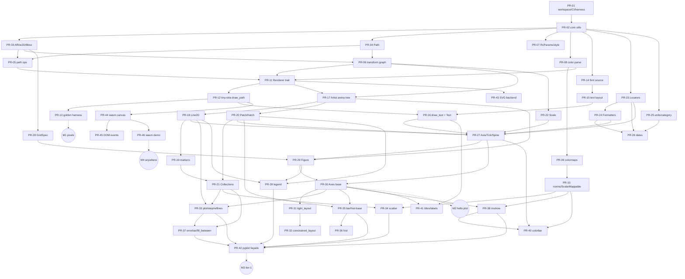
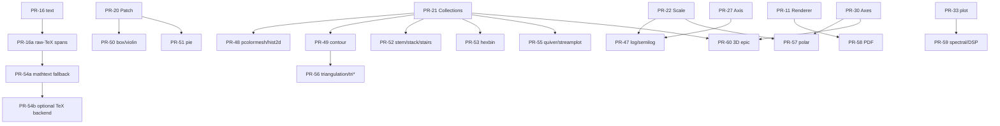

# 04 — Implementation Plan & PR DAG (rizzma)

> The complete plan to build rizzma — a Rust reimplementation of "the good parts" of
> pyplot/matplotlib that also runs in wasm. This document turns docs
> [01 — Architecture](01-architecture.md), [02 — Plot Types](02-plot-types.md), and
> [03 — Foundational Components](03-foundational-components.md) into an executable
> backlog: a directed acyclic graph of pull requests, grouped into phases, with
> milestones, dependencies, acceptance criteria, and a parallelization strategy.

## Table of Contents

1. [Goals, non-goals & scope](#1-goals-non-goals--scope)
2. [Workspace & crate structure](#2-workspace--crate-structure)
3. [Engineering conventions](#3-engineering-conventions)
4. [Testing strategy (the golden-image harness)](#4-testing-strategy-the-golden-image-harness)
5. [Milestones](#5-milestones)
6. [The PR DAG — phase by phase](#6-the-pr-dag--phase-by-phase)
7. [Critical path & parallelization](#7-critical-path--parallelization)
8. [Mermaid DAGs](#8-mermaid-dags)
9. [Risk register](#9-risk-register)
10. [Effort estimate & sequencing summary](#10-effort-estimate--sequencing-summary)

---

## 1. Goals, non-goals & scope

### Goals
- A **clean-room Rust** plotting library with a matplotlib-shaped object model
  (Figure → Axes → Artists) and a thin **pyplot-style stateful façade**.
- **One renderer abstraction, many targets**: a `Renderer` trait with `tiny-skia`
  (raster→PNG) as the reference backend, plus SVG and a **wasm `<canvas>`** backend that
  produce the *same* figure.
- **Pixel/numeric parity where it's cheap to have it**: tick locators, transforms, color
  normalization, and layout arithmetic should match matplotlib closely enough to diff
  against its output.
- Ship **Tier-1 plots** (≈80% of real-world usage) first on a single shared primitive
  core, then expand outward along the tiered backlog in doc 02.

### Non-goals (explicitly out of scope, at least initially)
- Bundling a TeX distribution or making external LaTeX a hard dependency. TeX-backed
  rendering is an optional native/export path with a graceful fallback.
- External LaTeX is never default, never required in wasm, and never on the critical
  path for deterministic cross-backend output.
- GUI toolkit backends (Qt/Tk/GTK/wx/macosx). The only interactive target is wasm canvas.
- 1:1 API compatibility with every matplotlib kwarg. We reimplement the *good parts* and
  the *common* kwargs, not the 20-year long tail.
- Animation framework, `mpl_toolkits` (axes_grid1, etc.) beyond mplot3d, and the
  `pylab` namespace.

### Scope boundaries
- **Native + wasm** are first-class from the start; every crate must compile to
  `wasm32-unknown-unknown` or be cfg-gated out of the wasm build.
- The C/C++ kernels matplotlib relies on (Agg, FreeType, `_path`, qhull) are replaced by
  Rust crates per the doc 03 §12 mapping — **no C dependencies** in the default build.
- Math/TeX rendering has **forked implementation paths**:
  - raw TeX spans preserve the source expression and fallback-warning context;
  - rich frontend targets, including Agent Portal, may pass raw TeX/math spans through
    so the host renderer can typeset them directly;
  - the portable render path is `rizzma-mathtext`, whose box/glue layout tree is the
    deterministic backend-independent render IR for supported math;
  - pixel/vector export targets may use an optional, feature-gated TeX backend when the
    required binaries are available; when unavailable or unsupported, rizzma emits a
    warning and falls back to mathtext or raw TeX instead of failing the figure.

---

## 2. Workspace & crate structure

A cargo workspace. Crates are layered to mirror the dependency DAG (doc 03 §11) so the
build graph *is* the architecture. Lower crates never depend on higher ones.

```
rizzma/
├── Cargo.toml                      # [workspace]
├── crates/
│   ├── rizzma-core/                # cbook-equiv, RcParams, Path, Bbox, Affine2D,
│   │                               #   Transform graph, color, colormaps, norms
│   ├── rizzma-render/              # Renderer trait, GraphicsContext, Paint (no backend)
│   ├── rizzma-skia/               # tiny-skia raster backend  → PNG
│   ├── rizzma-text/               # font source + cosmic-text layout/metrics
│   ├── rizzma-artist/             # Artist tree (arena), Line2D, Patch, markers, collections
│   ├── rizzma-axis/               # ticker, scale, units, dates, Axis/Tick/Spine
│   ├── rizzma-figure/             # GridSpec, Figure, Axes, layout engines, legend, colorbar
│   ├── rizzma-plot/               # Axes plotting methods (plot/scatter/bar/…)
│   ├── rizzma-pyplot/             # stateful façade + FigureRegistry
│   ├── rizzma-svg/                # SVG vector backend
│   ├── rizzma-wasm/               # canvas backend + wasm-bindgen entry points
│   ├── rizzma-mathtext/           # TeX-subset math layout (later)
│   └── rizzma-3d/                 # mplot3d-equivalent proj3d/art3d (later)
├── xtask/                          # build/test automation (golden regen, wasm demo)
├── tests/                          # workspace-level golden-image integration tests
│   ├── baselines/                 # reference PNGs (matplotlib-generated)
│   └── cases/                     # rizzma test scripts that emit PNG/SVG
└── examples/                       # gallery examples doubling as docs
```

> **Note on granularity.** Several "crates" above can start life as *modules* inside
> `rizzma-core` and be promoted to their own crate when the boundary stabilizes. The PR
> DAG is written against the final layout; collapsing two early crates into one is a
> reviewer's discretion, not a plan change.

Primary external crates (from doc 03 §12): `kurbo`, `lyon` (geometry); `glam` (affine
math); `tiny-skia` (raster); `cosmic-text` + `fontdb` (text/fonts); `palette` +
embedded LUTs (color); `chrono` (dates); a Cassowary crate (`casuarius`) for constrained
layout; `image` + `fast_image_resize` (resampling); `spade` (triangulation, late);
`wasm-bindgen` + `web-sys` (wasm); `serde` (RcParams).

---

## 3. Engineering conventions

- **Branching:** every PR on its own branch, prefixed `meawoppl/`, dashes for spaces
  (e.g. `meawoppl/pr-12-skia-draw-path`). Never commit to `main` except where explicitly
  directed.
- **PR sizing target:** S (<300 LOC net), M (300–800), L (800–1500). Anything XL must be
  split before review. Each PR is independently reviewable and leaves `main` green.
- **Definition of Done (per PR):** compiles on native **and** `wasm32` (or is cfg-gated);
  `cargo fmt` clean; `cargo clippy -D warnings`; unit tests for new logic; any new public
  surface documented; if it touches rendering, at least one golden-image or
  numeric-parity test; CHANGELOG entry when bumping a version.
- **Dependencies via `cargo add`**, never hand-edited `Cargo.toml`. `wasm-opt` stays on.
- **No dead code / no back-compat shims** unless asked. Edit in steps, not via scripts.

---

## 4. Testing strategy (the golden-image harness)

This is the backbone that lets us claim "matplotlib parity," so it lands early (PR-13).

1. **Baseline generation.** A Python script (run once per case, checked-in output) uses
   the cloned `references/matplotlib` to render a figure to PNG at fixed dpi/size/font
   with a pinned style, saved under `tests/baselines/`. Determinism knobs: fixed
   `svg.hashsalt`, `Agg` backend, embedded DejaVu Sans, `font.family` pinned.
2. **rizzma render.** The matching rizzma test renders the same scene to PNG.
3. **Comparison.** A perceptual diff (per-pixel RMS with a tolerance, à la matplotlib's
   own `compare_images`) fails the test above a threshold and writes a side-by-side diff
   artifact to `target/`. Tolerances start generous and tighten as antialiasing/text
   metrics converge.
4. **Numeric-parity unit tests** (no rendering) for the deterministic engine room:
   `MaxNLocator`/`ScalarFormatter`/`AutoDateLocator` tick values, `Normalize` outputs,
   `Affine2D` composition, `GridSpec` positions, color `to_rgba`. These port matplotlib's
   own test vectors and must match to tight float tolerance.
5. **Cross-backend equivalence.** Once SVG/canvas land (M4), a test renders one scene to
   PNG, SVG-rasterized-via-resvg, and a headless canvas, and diffs all three.
6. **wasm smoke.** `wasm-pack test --headless` for the wasm crate; a size budget check on
   the demo `.wasm`.

---

## 5. Milestones

| ID | Name | Definition (demoable outcome) | Gated by |
|----|------|-------------------------------|----------|
| **M0** | Scaffolding green | Workspace builds native+wasm; CI runs fmt/clippy/test; empty golden harness | PR-01, PR-02 |
| **M1** | Pixels on screen | A colored, dashed, clipped **polyline → PNG** via the `Renderer` trait + tiny-skia | PR-11–PR-13 |
| **M2** | Hello-world plot | `plot([...])` on **labeled linear axes with auto ticks** → PNG (the spine of the whole library) | PR-27–PR-30 |
| **M3** | Tier-1 gallery | `plot/scatter/bar/hist/errorbar/fill_between/imshow` + `legend/colorbar/title` reproducible vs matplotlib goldens, driven through the **pyplot façade** | PR-33–PR-42 |
| **M4** | Write once, render anywhere | The *same* figure renders identically to **PNG, SVG, and browser `<canvas>`**, with DOM interactivity | PR-43–PR-46 |
| **M5** | Breadth | Tier-2/3 plots (log/contour/pcolormesh/box/pie/quiver/polar), TeX/math rendering, PDF | PR-47–PR-59 |
| **M6** | 3D | mplot3d-equivalent surface/scatter/wireframe with painter's-algorithm depth sort | PR-60 |

Critical path to a usable library is **M0 → M1 → M2 → M3 → M4**. Everything in M5/M6 is
incremental and largely parallelizable on top of M3.

---

## 6. The PR DAG — phase by phase

Legend — **Size:** S/M/L. **Deps:** PR ids that must merge first. Each PR row lists its
acceptance signal.

### Phase 0 — Scaffolding  *(→ M0)*

| PR | Title | Size | Deps | Acceptance |
|----|-------|------|------|------------|
| **PR-01** | Workspace, CI, lint, fmt, empty golden-image harness + `xtask` | M | — | `cargo build` (native+wasm) & `cargo test` green in CI; harness can diff two PNGs |
| **PR-02** | `rizzma-core` skeleton: error types, numeric/array helpers (cbook-equiv), `CallbackRegistry`/signal | M | PR-01 | unit tests for helpers; masked/NaN handling covered |

### Phase 1 — Geometry & transforms

| PR | Title | Size | Deps | Acceptance |
|----|-------|------|------|------------|
| **PR-03** | `Affine2D` + `Bbox`/`TransformedBbox` (over `glam`) | M | PR-02 | parity tests vs matplotlib affine composition & bbox transforms |
| **PR-04** | `Path` (vertices+codes) over `kurbo`/`lyon`: `iter_segments`, unit-shape factories | M | PR-02 | round-trips codes; unit circle/rect/regular-poly match reference vertices |
| **PR-05** | Path ops: `transformed`, `contains_point`, simplify (Douglas-Peucker), Liang-Barsky clip | M | PR-03, PR-04 | simplify/clip parity tests; point-in-path correctness |
| **PR-06** | Transform graph: `Transform` enum (affine/non-affine), composition `+`, blended, **dirty-flag invalidation** | L | PR-03, PR-04 | data→axes→display chain builds; generation counter invalidates caches; no `Rc`/`RefCell` |

### Phase 2 — Config & color  *(parallel with Phase 1 after PR-02)*

| PR | Title | Size | Deps | Acceptance |
|----|-------|------|------|------------|
| **PR-07** | Typed `RcParams` + default style + **prop cycle** (`serde` struct, ported defaults) | M | PR-02 | default values match matplotlibrc; style override merge works |
| **PR-08** | Color: `to_rgba` parser + named-color tables (`_color_data`) | S | PR-02 | parses hex/rgb/rgba/named/cycle refs; parity table vs matplotlib |
| **PR-09** | Colormaps: `LinearSegmentedColormap`/`ListedColormap` + `_create_lookup_table` + embedded builtin LUTs (viridis, etc.) | M | PR-08 | LUT sampling matches matplotlib to 1/256 |
| **PR-10** | `Normalize` + `LogNorm`/`PowerNorm`/`BoundaryNorm` + `ScalarMappable`/`Colorizer` | M | PR-09 | norm outputs parity-tested; defer `make_norm_from_scale` link to PR-22 |

### Phase 3 — Renderer seam & raster backend  *(→ M1)*

| PR | Title | Size | Deps | Acceptance |
|----|-------|------|------|------------|
| **PR-11** | `Renderer` trait + `GraphicsContext`/`Paint` state (color, lw, dash, cap/join, clip, alpha, hatch) | M | PR-05, PR-06, PR-08 | trait compiles with default `draw_markers`/`draw_path_collection` fallbacks |
| **PR-12** | `rizzma-skia`: implement `draw_path` (fill/stroke/dash/clip) → `Pixmap`/PNG; Y-flip; `points_to_pixels` | L | PR-11 | renders dashed clipped polygon; PNG byte-stable |
| **PR-13** | Golden-image harness wired to real renders + first baselines from matplotlib | M | PR-12 | a polyline case passes within tolerance vs matplotlib PNG |

> **M1 reached:** colored, dashed, clipped polyline → PNG, validated against matplotlib.

### Phase 4 — Text

| PR | Title | Size | Deps | Acceptance |
|----|-------|------|------|------------|
| **PR-14** | Font source: embed DejaVu Sans + math font; pluggable loader (native `fontdb` / embedded-for-wasm) | M | PR-02 | font resolves on native+wasm; `findfont`-style weighted match |
| **PR-15** | Text layout & metrics via `cosmic-text`: width/height/descent, multiline, h/v align, rotation | L | PR-14 | `get_text_width_height_descent` parity within tolerance; multiline anchored correctly |
| **PR-16** | `draw_text` on renderer (glyph-outline→`draw_path` path, raster blit option) + `Text` artist | M | PR-12, PR-15 | rendered label golden-matches; rotated text correct |
| **PR-16a** | Math text policy + raw-TeX span model: classify plain text/math/raw TeX, preserve source + fallback warnings through frontend-capable renderers | M | PR-16 | Agent Portal/HTML-style output can emit TeX spans unchanged; renderers have an explicit unsupported-math warning path |

### Phase 5 — Artist primitives

| PR | Title | Size | Deps | Acceptance |
|----|-------|------|------|------------|
| **PR-17** | `Artist` trait/enum + **arena-owned** scene tree (slotmap ids) + zorder draw recursion + dirty flag | L | PR-06, PR-11 | tree builds; draw order = zorder; no back-pointer cycles |
| **PR-18** | `Line2D` (polyline, dashes, draw styles) | M | PR-17 | line golden-matches incl. dash patterns |
| **PR-19** | `MarkerStyle` + marker path registry + `draw_markers` (skia) | M | PR-18 | all stock markers render; positions snap correctly |
| **PR-20** | `Patch` hierarchy (Rectangle/Circle/Polygon/Wedge/FancyArrow) + `hatch` | M | PR-17 | filled/edged patches + hatch tiles golden-match |
| **PR-21** | `Collection` family + **batched `draw_path_collection`** (Path/Line/Poly/QuadMesh) | L | PR-19, PR-20 | 10k-point scatter renders in one batched call; perf sane |

### Phase 6 — Axis machinery

| PR | Title | Size | Deps | Acceptance |
|----|-------|------|------|------------|
| **PR-22** | `Scale` trait: Linear/Log/Symlog/Logit (transform+locator+formatter bundle); wire `make_norm_from_scale` | M | PR-06 | scale transforms parity-tested; LogNorm now linked |
| **PR-23** | Locators: MaxN (nice-numbers), Multiple, Linear, Null, Fixed, Index, Log | L | PR-02 | tick-value vectors match matplotlib test cases exactly |
| **PR-24** | Formatters: Scalar, Log(+Mathtext/SciNotation), Func, StrMethod, Eng, Percent | M | PR-23 | formatted strings match incl. offset/order-of-magnitude |
| **PR-25** | `units`/`category` conversion registry (trait-based) | S | PR-02 | category & unit round-trips |
| **PR-26** | `dates`: `chrono` epoch + `AutoDateLocator`/`DateFormatter`/`ConciseDateFormatter` | L | PR-23, PR-24, PR-25 | auto date-tick selection parity on canonical ranges |
| **PR-27** | `Axis`/`Tick`/`Spine` drawing + autoscaling + grid | L | PR-18, PR-20, PR-22, PR-23, PR-24, PR-16 | a standalone axis with ticks+labels+grid golden-matches |

### Phase 7 — Figure / Axes / layout  *(→ M2)*

| PR | Title | Size | Deps | Acceptance |
|----|-------|------|------|------------|
| **PR-28** | `GridSpec` + `SubplotSpec` (pure arithmetic) | M | PR-03 | subplot positions match `get_grid_positions` |
| **PR-29** | `Figure` (artist tree + draw loop + `savefig`) + `SubFigure` | M | PR-17, PR-27, PR-28 | empty figure + patch saves to PNG; dpi/size honored |
| **PR-30** | `Axes` base: coordinate chain (`transData`/`transAxes`/blended), `add_artist`, `set_xlim`/autoscale, spines wiring | L | PR-27, PR-29 | `ax.add_line` + autoscale produces correct data limits & ticks |
| **PR-31** | `tight_layout` heuristic | M | PR-30 | overlapping labels resolved; spacing matches within tolerance |
| **PR-32** | `constrained_layout` over a Rust Cassowary crate | L | PR-31 | multi-axes grid lays out without overlap |

> **M2 reached:** `plot` on labeled linear axes with auto ticks → PNG.

### Phase 8 — Tier-1 plotting API + pyplot  *(→ M3)*

| PR | Title | Size | Deps | Acceptance |
|----|-------|------|------|------------|
| **PR-33** | `Axes.plot` + `step` + reference lines/spans (`axhline`/`axvline`/`axhspan`/`axvspan`/`hlines`/`vlines`) | M | PR-30, PR-18, PR-21 | line/step/ref-line gallery golden-matches |
| **PR-34** | `Axes.scatter` (`PathCollection` + color/size mapping) | M | PR-21, PR-10 | mapped scatter + colorbar-ready array golden-matches |
| **PR-35** | `Axes.bar`/`barh` + `BarContainer` + `bar_label` | M | PR-20, PR-30 | grouped/stacked bars golden-match |
| **PR-36** | `Axes.hist` (binning + bars) | M | PR-35 | histogram (counts/density, multiple) golden-matches |
| **PR-37** | `Axes.errorbar` + `fill_between`/`fill_betweenx` | M | PR-33, PR-21 | caps+bars+band golden-match |
| **PR-38** | `AxesImage` + `imshow` + resampling (`image`/`fast_image_resize`) | M | PR-10, PR-30 | imshow with norm+cmap+interpolation golden-matches |
| **PR-39** | `Legend` (`OffsetBox` packer + best-location search) | L | PR-29, PR-18, PR-20 | auto-placed legend golden-matches |
| **PR-40** | `Colorbar` | M | PR-10, PR-38, PR-27 | colorbar with ticks/label golden-matches |
| **PR-41** | Title/labels/`annotate`/`text` polish on Axes | S | PR-16, PR-30 | titles, axis labels, annotations placed correctly |
| **PR-42** | `pyplot` façade + `FigureRegistry` (`gcf`/`gca`/`figure`/`subplots`/`show`/`savefig`) | M | PR-33, PR-34, PR-35, PR-37, PR-38, PR-39 | full Tier-1 examples run through `plt::*` |

> **M3 reached:** Tier-1 gallery reproducible vs matplotlib goldens, via the stateful API.

### Phase 9 — Second backends + wasm  *(→ M4)*

> **Status (2026-07):** complete. PR-43/-44 landed first (SVG renderer; `src/wasm/`
> blit path, `WasmFigure`, demo page, CI size budget); the remainder of the phase
> was re-planned as W1–W6 of
> [`06-wasm-interactive-plan.md`](06-wasm-interactive-plan.md) — superseding
> PR-45/-46 — and shipped in release 1.1.0 (DPR-correct rendering, the JS plotting
> surface, the event bridge and pan/zoom/hover tools, the per-frame budget, and
> headless-browser CI). **M4 is fully reached, including interactivity.** The rows
> below are kept for the historical DAG.

| PR | Title | Size | Deps | Acceptance |
|----|-------|------|------|------------|
| **PR-43** | `rizzma-svg` vector renderer (path/marker/clip/hatch/image/text via defs+use) | L | PR-11 | SVG of Tier-1 figure rasterizes (resvg) to match PNG golden |
| **PR-44** | `rizzma-wasm` canvas renderer (tiny-skia `Pixmap` → `putImageData`) + `wasm-bindgen` entry | L | PR-12 | headless canvas render matches PNG golden |
| **PR-45** | DOM event bridge: mouse/key/resize → `MouseEvent`/`KeyEvent` (y-flip, button remap) | M | PR-44 | superseded by doc 06 W3a/W3b (no y-flip: core is top-down px) |
| **PR-46** | wasm demo page + `.wasm` size & per-frame perf budget | S | PR-44 | demo + size budget done; perf budget superseded by doc 06 W5 |

> **M4 reached** (release 1.1.0): identical figure to PNG / SVG / browser canvas,
> interactive — the interactivity criterion was delivered by doc 06's W5.

### Phase 10 — Tier-2/3/4 expansion  *(→ M5; highly parallel, each depends only on its primitives)*

| PR | Title | Size | Deps | Tier |
|----|-------|------|------|------|
| **PR-47** | Log/symlog end-to-end (`loglog`/`semilogx`/`semilogy`) | S | PR-22, PR-27 | 2 |
| **PR-48** | `pcolormesh`/`pcolor`/`QuadMesh` + `hist2d` | M | PR-21 | 2 |
| **PR-49** | `contour`/`contourf` + marching squares + `clabel` | L | PR-21, PR-41 | 2 |
| **PR-50** | `boxplot`/`bxp`/`violinplot` + stats (KDE) | M | PR-33, PR-20 | 2 |
| **PR-51** | `pie` + `Wedge` + equal-aspect | S | PR-20 | 2 |
| **PR-52** | `stem`/`eventplot`/`stackplot`/`stairs`/`broken_barh`/`ecdf` | M | PR-33, PR-21 | 2 |
| **PR-53** | `hexbin` | S | PR-21 | 2 |
| **PR-54a** | `rizzma-mathtext` portable fallback (TeX-subset box-and-glue engine; `$...$`) | L | PR-16a | common inline math renders deterministically without external binaries; unsupported constructs fall back to raw TeX with warning |
| **PR-54b** | Optional native TeX export backend (`latex`/`dvipng`/`dvisvgm` or equivalent discovery + cache; feature-gated/off by default) | M | PR-54a | pixel/SVG exports may use real TeX when explicitly enabled and binaries exist; missing binaries produce a structured warning + mathtext/raw-TeX fallback |
| **PR-55** | `quiver`/`quiverkey`/`barbs`/`streamplot` (ODE integrator) | L | PR-21 | 3 |
| **PR-56** | Triangulation (`spade`) + `tricontour`/`tricontourf`/`tripcolor`/`triplot` | L | PR-49 | 3 |
| **PR-57** | Polar projection (`PolarAxes`/`PolarTransform`) | L | PR-30, PR-22 | 3 |
| **PR-58** | `rizzma-pdf` vector backend | M | PR-11 | — |
| **PR-59** | Spectral/DSP family (`psd`/`csd`/`cohere`/`specgram`/`*_spectrum`/`xcorr`/`acorr`) | M | PR-33 | 4 |

### Phase 11 — 3D  *(→ M6; its own epic)*

| PR | Title | Size | Deps | Acceptance |
|----|-------|------|------|------------|
| **PR-60** | `rizzma-3d`: `proj3d` + `art3d` (`*3DCollection`, painter's depth sort) + `plot3D`/`scatter3D`/`plot_surface`/`plot_wireframe`/`plot_trisurf`/`bar3d`/`voxels`/`quiver3D` | XL → **split** | PR-21, PR-30 | surface/scatter/wireframe golden-match; split into ≥4 PRs (projection core, line/scatter, surfaces, bars/voxels) |

---

## 7. Critical path & parallelization

**Critical path (longest dependency chain to a usable library):**

```
PR-01 → PR-02 → PR-04 → PR-05 → PR-11 → PR-12 → (PR-16 needs PR-15←PR-14) →
PR-17 → PR-18 → PR-21 → PR-27 → PR-30 → PR-33 → PR-42        (= M3)
```

…then M4 forks off PR-12 (PR-44) and PR-11 (PR-43) independently.

**What can run in parallel** (independent sub-DAGs once `PR-02` lands):

- **Track A — geometry/transforms:** PR-03 → PR-04 → PR-05 → PR-06.
- **Track B — config/color:** PR-07; PR-08 → PR-09 → PR-10. (Joins at PR-11/PR-34/PR-38.)
- **Track C — text:** PR-14 → PR-15 → PR-16. (Needs PR-12 only at PR-16.)
- After PR-11/PR-12 land, **Track D — primitives** (PR-17→18→19/20→21) and **Track E —
  axis** (PR-22, PR-23→24, PR-25, →26, →27) run largely in parallel, joining at PR-27/PR-30.
- **Phase 10** PRs are nearly all leaves: once their listed primitive deps exist, they can
  be picked up by independent contributors with no ordering among themselves.

This is the structure that makes the project **fan-out-able**: the moment M2 lands, the
entire Tier-1 phase (PR-33…PR-41) and most of Phase 10 become parallelizable work items
gated only on shared primitives, not on each other.

---

## 8. Mermaid DAGs

### 8.1 MVP critical path (Phases 0–9, → M4)



### 8.2 Expansion phase (Phase 10–11, → M5/M6) — leaves hanging off shared primitives



---

## 9. Risk register

| # | Risk | Impact | Mitigation |
|---|------|--------|------------|
| R1 | **Text metric drift** — cosmic-text glyph metrics differ from FreeType, breaking layout & goldens | High (touches every labeled plot) | Embed the *same* DejaVu Sans matplotlib ships; tune golden tolerance for text regions; numeric-test `text_extent` against matplotlib early (PR-15) |
| R2 | **Antialiasing parity** — tiny-skia (premultiplied) vs Agg (straight alpha) edges differ (doc 03 §10/Agg report) | Medium | Accept perceptual tolerance, not byte-equality; document the compositing-model difference; never promise bit-exact raster |
| R3 | **Transform-graph redesign** — replacing the weakref DAG with dirty-flags has subtle invalidation bugs | Medium | Generation-counter strategy from doc 01 §11.4; heavy unit tests on cache invalidation; start with "recompute on demand," optimize later |
| R4 | **wasm font story** — no FS discovery; bundle bloats `.wasm` | Medium | Embed one sans + one math font only; make font source pluggable (`fetch` on web); size budget gate in PR-46 |
| R5 | **Locator/date parity** — matplotlib's tick algorithms have many float-fudge edge cases (doc 03 ticker/dates reports) | Medium | Port the exact epsilons/floor-division semantics; reuse matplotlib's own test vectors verbatim |
| R6 | **Scope creep into the long tail** — chasing every kwarg | Medium | Hard tier discipline from doc 02; Phase 10 PRs ship the *common* signature, not every option |
| R7 | **math/TeX split complexity** — frontend passthrough, portable mathtext, and optional native TeX can drift | Medium | Keep raw TeX as source/passthrough metadata and mathtext's box tree as the canonical portable render IR; golden-test mathtext output, not external LaTeX; native TeX stays feature-gated/off by default and warns/falls back when unavailable |
| R8 | **3D is an iceberg** — depth sorting, lighting, autoscale | High (if attempted early) | Gate entirely behind M6; split PR-60 into ≥4 PRs; treat as optional product surface |
| R9 | **Constrained layout solver** — Cassowary crate maturity | Low/Med | tight_layout (PR-31) ships first and covers most needs; constrained_layout (PR-32) is independent and deferrable |

---

## 10. Effort estimate & sequencing summary

- **62 PRs** across **11 phases** and **6 milestones**.
- **Critical path to M3 (Tier-1, usable):** ~28 PRs (Phases 0–8 minus the parallelizable
  leaves). With the parallel tracks (geometry / color / text / primitives / axis), the
  *chain depth* is ~14 PRs — that's the real wall-clock floor.
- **M4 (wasm)** adds 4 PRs forking off the renderer seam — can begin the moment PR-12
  lands (in parallel with all of Phases 5–8).
- **M5 (breadth)** is ~14 mostly-leaf PRs, fully parallelizable across contributors.
- **M6 (3D)** is one XL epic to be split into ≥4 PRs.

**Recommended execution order:** drive the **critical path to M2 single-threaded** (it's
the spine everything hangs on and benefits from one consistent hand), then **fan out**:
M4's wasm work, the Tier-1 plotting PRs (PR-33…PR-41), and the earliest Phase-10 leaves
can all proceed concurrently once M2's primitives exist. The golden-image harness (PR-13)
and numeric-parity tests are the throttle that keeps parallel work honest.

> Cross-references: build order ↔ doc 01 §11.7 & doc 03 §13; crate↔crate mapping ↔
> doc 03 §12; plot tiers ↔ doc 02 §5–7; the renderer-seam-is-the-only-sacred-abstraction
> principle ↔ doc 01 §11.2/§11.6.

---

## 11. Execution log & locked decisions

A running record of what's actually been built and the concrete decisions taken (so the
plan above stays the *intent* and this section is the *ground truth*).

### Locked decisions (Phase 0)
- **Edition 2024, resolver 3.** Workspace pins the **current stable** toolchain via
  `rust-toolchain.toml` (`rust-version = "1.96"`); bump in lockstep with new stables.
- **No `unsafe` by default**, clippy `all = warn` inherited via `[workspace.lints]`; CI
  runs `-D warnings`.
- **Two extra crates beyond doc §2:** an umbrella **`rizzma`** crate (public facade +
  crates.io name reservation) and an **`xtask`** automation crate (image-diff harness).
- **crates.io name reserved:** `rizzma` v0.0.1 published as a placeholder.
- **Repo policy:** `main` is **squash-only** (merge/rebase disabled, branch auto-deleted),
  protected with required CI check `fmt + clippy + test`, linear history, non-strict
  (so independent crate PRs can auto-merge in parallel). Admin bypass retained as an
  escape hatch.
- **Workflow:** every change on a `meawoppl/*` branch → PR → auto-merge on green
  required checks (`fmt + clippy + test`, plus focused guard jobs such as wasm size).

### Milestones reached
- **M0 (scaffolding green)** — ✅ workspace, CI, toolchain pin.
- **M1 (first pixels)** — ✅ `SkiaRenderer` draws filled/stroked paths to PNG, pixel-verified.
- **M2 (line on labeled axes → PNG)** — ✅ `Figure`/`Axes`; `sin(x)` example **visually verified**.
- **M3 (Tier-1 gallery via the façade)** — ✅ COMPLETE (incl. `imshow`). `plot`/`bar`/`barh`/`scatter`/`scatter_mapped`/
  `hist`/`fill_between`/`step`/`errorbar`/reference-lines + `legend` + `colorbar`, driven
  through the `pyplot` façade. Verified visually: a viridis spiral scatter, a histogram, a
  bar chart with `axhline`, and a two-line plot with legend + colorbar — all matplotlib-quality.
- **M4 (write once, render anywhere)** — ✅ COMPLETE: the **SVG backend** (`rizzma-svg`) is a
  second `Renderer`, `Figure::save_svg` exports the *same* scene to PNG (skia) and SVG,
  and `rizzma-wasm` can render a figure to straight RGBA and blit it into browser
  `<canvas>` `ImageData`. A browser demo page exists, and host-side PNG-vs-SVG
  raster parity is covered for a text-free renderer-seam scene. Figure coordinates can
  now round-trip between top-down canvas pixels and data coordinates, the wasm demo has a
  DOM-event hover data readout, and `xtask` can report/enforce wasm artifact size from a
  dedicated required CI workflow job. Remaining quality work: headless wasm smoke and
  wasm canvas parity.

### Merged PRs (#1–#79)
- **Infra/docs:** #1 scaffold/CI/toolchain, #2 licenses, #3/#20/#28/#32/#42 log updates,
  #5 `xtask` image-diff, #33 gallery publishing + doc-link CI, #34 TeX rendering path
  split, #38 `AGENTS.md` coordination rules, #39 wasm32 workspace check, #74 crates.io
  publish workflow, #78 log-scale axes integration design.
- **`rizzma-core`:** #4 `Affine2D`+`Bbox`, #8 `Path`, #10 `color::Rgba`, #12 named colors +
  `Normalize` + colormaps (viridis/gray) + `to_rgba_array`, #22 typed `RcParams` (serde).
- **`rizzma-render`:** #10 `Renderer` trait + `GraphicsContext`.
- **`rizzma-skia`:** #11 `tiny-skia` raster backend → PNG, #29 `draw_image` raster blit.
- **`rizzma-svg`:** #24 SVG vector backend (2nd `Renderer`), #36 embedded raster
  `draw_image` via PNG data URIs, #44 resvg-backed SVG image rasterization coverage.
- **`rizzma-text`:** #6 font embed (DejaVu) + metrics, #14 `text_to_path` glyph
  outlines, #53 render-independent math/raw-TeX span model.
- **`rizzma-mathtext`:** #55 portable box-and-glue mathtext layout engine, #57 accents,
  expanded symbol coverage, and variant-agnostic geometry placement accessors, #61
  `\left...\right` delimiter geometry and large operators, #64 radicals, `\text{...}`,
  and broader named symbol coverage, #75 explicit combined `MathElement::Fraction`
  geometry.
- **`rizzma-artist`:** #13 `Artist`+`Line2D`, #16 `Patch`, #18 `MarkerStyle`,
  #21 `Collection`, #37 builder setter cleanup, #41 scatter marker sizing in device units,
  #54 `QuadMesh`.
- **`rizzma-axis`:** #7 ticker, #9 scales (lin/log/symlog/logit), #17 renderable `Axis`,
  #68 date conversion, auto date locator, and date formatters, #71 log locator and
  formatter numerics, #76 mathtext log formatter, #77 automatic date minor locator.
- **`rizzma-figure`:** #15 `GridSpec`, #19 `Figure`+`Axes`, #23 Tier-1 methods, #25 scatter/
  hist/errorbar, #27 legend/colorbar/`save_svg`, #30 prop-cycle, #31 `imshow`,
  #43 PNG-vs-SVG raster parity test for a renderer-seam scene, #47 pixel↔data
  coordinate inversion helpers for interaction, #51 `stem`/`stairs` Tier-2 plots,
  #52 `stackplot`/`broken_barh`, #54 `pcolormesh`, #56 `boxplot`, #58 mathtext in
  `Axes` titles, #60 `contour`, #63 `eventplot`/`fill_betweenx`/`ecdf`, #66
  `matshow`/`spy`/`hist2d`, #67 `pie`, #70 `violinplot`, #73 `hexbin`, #79
  `grouped_bar`.
- **`rizzma-pyplot`:** #26 stateful façade (`plot`/`scatter`/`bar`/`hist`/`savefig`/…).
- **`rizzma-wasm`:** #40 render-to-straight-RGBA core plus wasm-only Canvas `ImageData`
  blit entry points, #45 browser demo page, #49 DOM event readout demo.
- **`xtask`:** #48 wasm artifact size reporting/budget helper, #50 dedicated required CI
  budget job for the release wasm artifact.

### Known gaps / cleanups queued
- ✅ ~~`Axes::plot` prop-cycle~~ (done #30), ~~skia `draw_image`~~ (done #29),
  ~~SVG `draw_image`~~ (done #36), ~~artist builder setter shadowing~~ (done #37),
  ~~scatter marker size in data units~~ (done #41).
- skia `draw_text` is still a TODO stub (text renders as glyph paths today, which is fine).
- Arbitrary `clip_path` is still deferred; only rectangular clipping is implemented.
- Cross-backend equivalence is partly automated: PNG vs SVG-rasterized has a shared-scene
  diff, but wasm canvas output is not yet in that harness.
- headless wasm smoke and wasm canvas parity are still queued.
- Portable mathtext now handles common inline expressions, fractions, scripts, accents,
  radicals, `\text{...}`, `\left...\right` delimiter geometry, large operators, and
  common named symbols through backend-independent paths. Fractions now expose a combined
  `MathElement::Fraction` geometry path for variant-agnostic consumers. Remaining math
  fidelity work includes true extensible delimiter assembly, display-mode operator
  placement, math italic/metrics, broader TeX-subset coverage, and the optional native-TeX
  export backend.
- Per-method `///` rustdoc examples + embedded gallery images still to backfill (see below).

### Documentation pattern: a rendered example per graphic type

**Standard (apply to every plot type, existing and new).** Each public plotting
method (`Axes::plot`, `scatter`, `bar`, `hist`, `fill_between`, `errorbar`, `imshow`,
the reference-line family, and every Tier-2+ method as it lands) gets:

1. **A runnable rustdoc example** in its `///` docs — a small ```` ```no_run ```` (or
   doctest) snippet that builds a `Figure`, calls the method, and `save_png`s it, so
   the docs double as copy-paste recipes and compile under `cargo test --doc`.
2. **An embedded result image** via the gallery pattern: one figure per type is rendered
   by [`crates/rizzma-figure/examples/gallery.rs`], published to the orphan `gh-pages`
   branch by `.github/workflows/gallery.yml` (`force_orphan: true`, so no binaries enter
   any tree's history), and referenced from the method's doc comment as
   ``.
3. **CI consistency guards** (already wired into the required `fmt + clippy + test` job):
   - `cargo xtask check-gallery-links --strict` — every `gallery_*.png` referenced in a
     README/doc must actually be produced by `gallery.rs`, and every generated image must
     be referenced (no typo'd, stale, or orphaned image URLs).
   - `cargo doc --workspace --no-deps` under `RUSTDOCFLAGS=-D warnings` — broken/private
     intra-doc links fail the build.

**Backlog (per-type doc examples + images).** Add a `gallery.rs` case, the doc example,
and the embedded image for each, then let CI enforce the link/render consistency:
`plot` ☑ · `scatter` ☑ · `bar` ☑ · `barh` ☑ · `hist` ☑ · `fill_between` ☑ · `step` ☑ ·
`errorbar` ☑ · reference-lines/spans ☑ · `imshow` ☑ · `legend`+`colorbar` ☑ ·
`eventplot` ☑ · `fill_betweenx` ☑ · `ecdf` ☑ · `matshow` ☑ · `spy` ☑ · `hist2d` ☑ ·
`pie` ☑ · `violinplot` ☑ · `hexbin` ☑ · `grouped_bar` ☑  *(rendered in the gallery;
per-method `///` doc examples + per-method embeds still to backfill)* — then every
Tier-2/3 type (`loglog`/`semilog*`, `pcolormesh`,
`contour`, `boxplot`, `quiver`, `streamplot`, polar, 3D) ships its gallery case + doc
example **in the same PR** that adds the method (Definition-of-Done addition).

> DoD addendum: a PR that adds or changes a plotting method is not done until it adds the
> matching `gallery.rs` case, a runnable `///` example, and the embedded image URL — CI's
> `check-gallery-links` + `cargo doc -D warnings` will fail otherwise.

### Next
- M4 quality: headless wasm smoke and wasm canvas parity.
- Quality: native `draw_text`, arbitrary `clip_path`, renderer/backend parity checks.
- Tier-2: log-scale axes (`loglog`/`semilog*`; locator/formatter numerics done #71/#76
  and the transform-seam design is in `design/05-log-scale-axis-integration.md` from #78).
  Then broader mathtext coverage, optional native TeX export, date-axis integration, polar,
  PDF, 3D.
- Backfill per-method rustdoc examples + embedded images per the pattern above.

> Note: the DAG order is a guide, not a straitjacket. Self-contained leaves are pulled
> forward to maximize parallelism (often 3–4 worktree-isolated agents at once) while the
> critical-path spine (geometry → renderer → artists → axes → figure) stays coherent.
> ~40 PRs landed via squash + green CI with no `main` breakage.
